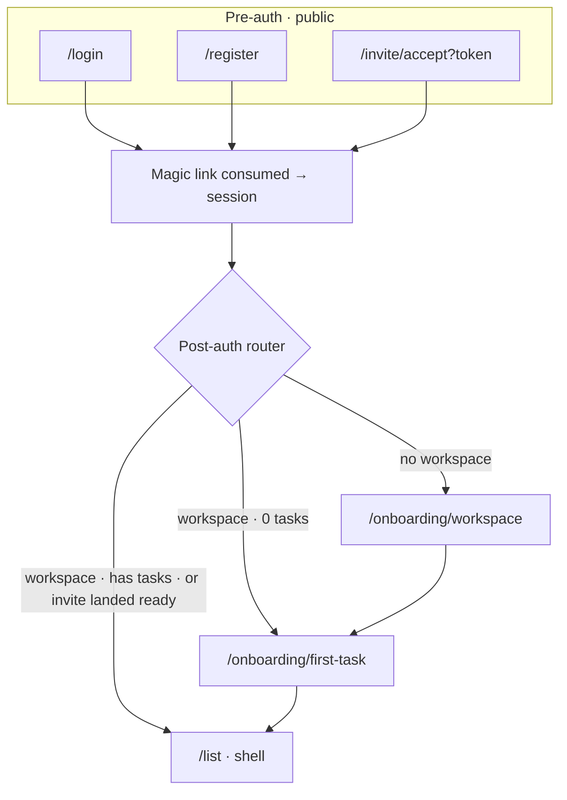
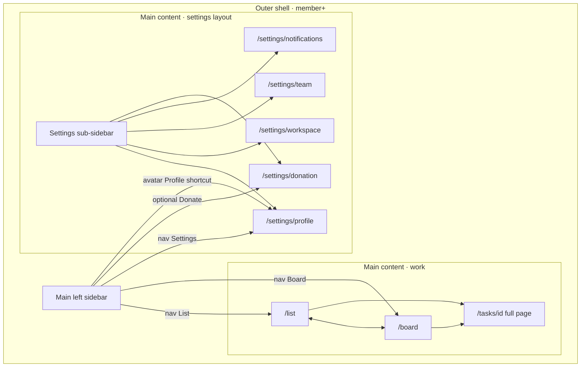
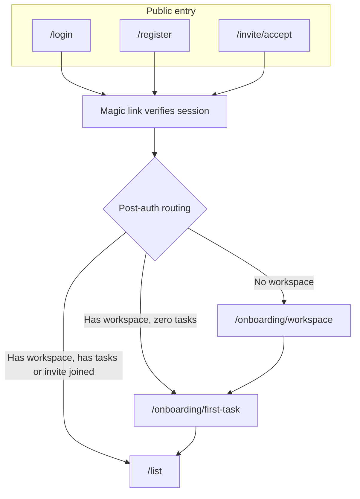
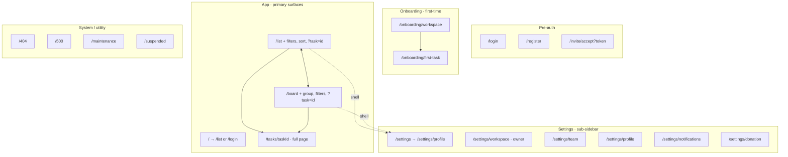
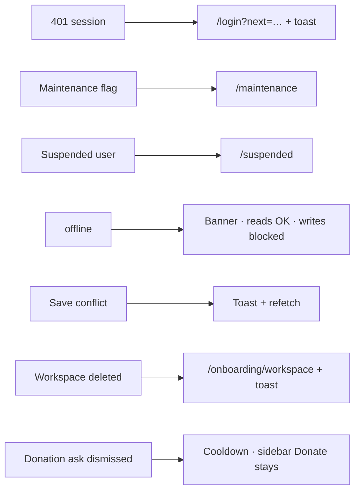

# aTodo — Sitemap

This document is the **authoritative screen and state inventory** for MVP UI design. It is derived from [modules-features.md](modules-features.md), [../research/personas.md](../research/personas.md), [../research/user-journeys.md](../research/user-journeys.md), and [../brief/design-brief-alignment.md](../brief/design-brief-alignment.md).

**Design rule:** Nothing is designed in downstream steps (e.g. Steps 5, 6.3, 6.4) unless it appears here.

**Product posture:** Magic-link auth only; single workspace; owner/member roles; desktop-first left-sidebar shell; hard delete for tasks; task detail as URL-param drawer on list/board plus full-page deep link; filters/sorts in URL; bell notifications (no `/inbox`); donation ask as **non-blocking modal or dismissible banner** on session milestones (or time-based rule) plus persistent sidebar entry.

---

## 1. Navigation Structure

**At-a-glance (routes by zone):**

```mermaid
flowchart TB
  subgraph PRE["Pre-auth"]
    direction TB
    p1["/login"]
    p2["/register"]
    p3["/invite/accept?token"]
  end
  subgraph ONB["Onboarding · first-time"]
    direction TB
    o1["/onboarding/workspace"]
    o2["/onboarding/first-task"]
  end
  subgraph APP["App · primary surfaces"]
    direction TB
    r["/ redirects authed to /list else /login"]
    l["/list + query filters, sort, ?task=id"]
    b["/board + query group, filters, ?task=id"]
    t["/tasks/taskId · full page"]
  end
  subgraph SET["Settings · left sub-sidebar"]
    direction TB
    s0["/settings → /settings/profile"]
    s1["/settings/workspace · owner"]
    s2["/settings/team"]
    s3["/settings/profile"]
    s4["/settings/notifications"]
    s5["/settings/donation"]
  end
  subgraph SYS["System / utility"]
    direction TB
    y404["/404"]
    y500["/500"]
    ym["/maintenance"]
    ys["/suspended"]
  end
  o1 --> o2
```



**How to read this chart:** Boxes are **route groups**. **§1a** below adds **connected arrows** (session + shell) so you can trace “where do I land if I…” without redrawing every URL inside each zone.

### 1a. Connected flows (session + shell)

**Relationship to other sections:** **§1** zone chart + path tree = **what exists**. **§1a** = **how you move between zones** in MVP. **§2** = full **auth + onboarding** detail. **§3** = whole-site zone map. **[../research/user-journeys.md](../research/user-journeys.md)** = fuller **click copy** and edge cases.

#### Pre-auth → session → onboarding or `/list`



#### Signed-in shell: sidebar → work vs settings → sub-page



*Opening **Settings** loads **`/settings/profile`** (or redirect from `/settings`) with **sub-sidebar + pane** together; edges from **Sub-sidebar** are **section switches** (same layout, new URL in the pane). **Donate** may also be reached from modal/banner (“manage”) per product posture.*

#### Canonical strips (designer “how do I get there?”)

Use these as **minimum happy paths** when auditing UI or copy. Steps name **chrome** then **URL** then **on-page action**.

| Goal | Strip |
|------|--------|
| **Edit profile** | `/login` or `/register` or `/invite/accept` → email magic link → **post-auth router** → (if needed) `/onboarding/workspace` → `/onboarding/first-task` → **`/list` in shell** → **main sidebar · Settings** *or* **avatar · Profile** → **`/settings/profile`** → **settings sub-sidebar · Profile** (if not already) → **edit fields inline · save** |
| **Invite / manage team** | Already in shell on **`/list`** or **`/board`** → **main sidebar · Settings** → **`/settings/team`** (sub-sidebar **Team**) → invite / revoke / resend (modals as specified in §3). *Alt entry:* sidebar **Invite** or empty-state CTA → same **`/settings/team`** where applicable. |
| **Open task detail** | **`/list`** or **`/board`** → **click row title / card** (not status chip) → **`?task=id` drawer** *or* land on **`/tasks/id`** from link → **Esc / back** returns to list/board. |
| **Workspace name / timezone (owner)** | Shell → **main sidebar · Settings** → **`/settings/workspace`** (sub-sidebar **Workspace**). |

**Full path tree (reference):**

```text
aTodo
├─ (pre-auth)
│  ├─ /login                                          [public]
│  ├─ /register                                       [public]
│  └─ /invite/accept?token=…                          [public, token-gated]
│
├─ (onboarding, first-time only)
│  ├─ /onboarding/workspace                           [authed, no-workspace]
│  └─ /onboarding/first-task                          [authed, has-workspace, zero-tasks]
│
├─ (app — primary surfaces)
│  ├─ /                                               [authed → /list ; logged-out → /login]
│  ├─ /list                                           [member+]   ← default landing
│  │     query: ?status=&assignee=&priority=&sort=&task=[id]
│  ├─ /board                                          [member+]
│  │     query: ?group=assignee&status=&assignee=&priority=&task=[id]
│  └─ /tasks/[taskId]                                 [member+]   ← full-page, direct-link only
│
├─ (app — settings, sub-pages with left sub-sidebar)
│  ├─ /settings                                       [member+]   → redirects to /settings/profile
│  ├─ /settings/workspace                             [owner only]
│  ├─ /settings/team                                  [member view, owner manage]
│  ├─ /settings/profile                               [self only]
│  ├─ /settings/notifications                         [self only]   ← "coming soon" copy in MVP
│  └─ /settings/donation                              [member+]
│
└─ (system / utility)
   ├─ /404                                            [public]
   ├─ /500                                            [public]
   ├─ /maintenance                                    [public]
   └─ /suspended                                      [authed, suspended]
```

**Notes**

- **Logout** is an action (clears session → redirects to `/login`), not a route.
- **Task detail** renders three ways: (a) right-side drawer over `/list` when `?task=[id]` is set; (b) right-side drawer over `/board` when `?task=[id]` is set; (c) standalone full page at `/tasks/[id]` for direct links and refresh.

**Shell layout — main sidebar vs primary surfaces vs settings**

- **One signed-in shell (desktop):** After auth, `/list`, `/board`, `/tasks/[taskId]`, and `/settings/*` all use the same **outer frame**: **main left sidebar** (workspace + nav) + **main content region**. Onboarding and pre-auth routes **do not** use this shell (full-width flows).
- **Primary surfaces are not “beside” the sidebar:** They are **what loads in the main content** when you pick a work route. **List** and **Board** are two URLs that swap that region; the sidebar stays put. **`?task=`** opens a **drawer over** the list/board content; the sidebar stays visible (drawer is stacked on the content column, not a third parallel “app”).
- **Settings is still the same shell:** Choosing **Settings** (sidebar or avatar) navigates to `/settings/…` so the **work surface is replaced** by the settings layout inside the **same** main content area. Inside that area, MVP uses a **settings sub-sidebar** (second narrow column) for `/settings/profile`, `/settings/team`, etc.; the **main workspace sidebar** remains the outer chrome.

**Role legend**

- `public` — no auth required.
- `member+` — any signed-in workspace member (owner or member).
- `owner only` — workspace owner.
- `self only` — any signed-in user, scoped to their own account record.

---

## 2. Auth & Onboarding Screens

**At-a-glance (happy paths + onboarding chain):**



| Screen | Path | Purpose |
|--------|------|---------|
| Login | `/login` | Email → "Send me a sign-in link" → check-email confirmation. No password. |
| Register | `/register` | Email + ToS → "Create my account" → magic link sent → click → signed in and verified. |
| Accept invite | `/invite/accept?token=…` | Inline join: "Join {workspace} as {invited email}" → "Send me a sign-in link" (email pre-filled, locked). Handles expired, revoked, already-member, workspace-deleted. |
| Onboarding step 1 — Workspace | `/onboarding/workspace` | Workspace name; timezone auto-detected, editable. |
| Onboarding step 2 — First task | `/onboarding/first-task` | Title only; defaults: status To do, assignee self. Skip allowed. |
| First-time empty state | On `/list` after onboarding | Three-CTA checklist: first task, first status move, first invite. |

**Constraint:** Onboarding stays ≤2 product steps; invite is deferred to empty-state guidance (per user journeys).

---

## 3. Full Page Inventory

Every **`###` block below** is one routable screen (or redirect) in MVP. **§1** has the same routes as a **text tree + role legend**; **§1a** has **connected flows + canonical strips** (e.g. edit profile). **§2** zooms only into **auth → onboarding → first `/list`**. This subsection adds a **whole-site zone map** so “sitemap” reads as **all** pages—not only the auth flow.

**How this diagram relates to the sidebar:** **App · primary surfaces** and **Settings** are **route groups**, not two different apps. Dotted **`shell`** edges mean “from `/list` or `/board`, user uses the **main left sidebar** to open Settings → URL becomes `/settings/…` while the **same outer shell** stays.” See **Shell layout** in **§1 Notes**.

**Inventory map (all MVP pages by zone):**



*Query strings, roles (`public` / `member+` / `owner` / `self`), and task-detail modes (drawer vs full page) stay exactly as in **§1** and each page block.*

### Login

- **Path:** `/login`
- **Priority:** primary
- **Purpose:** Sign in via magic link.
- **Primary persona:** All
- **Features present:** Magic-link auth (foundation)
- **Navigates to:** `/register`, `/list` after link click, `/onboarding/workspace` if no workspace
- **Reached from:** `/` when logged out, session-expired redirect

### Register

- **Path:** `/register`
- **Priority:** primary
- **Purpose:** Create account via magic link.
- **Primary persona:** Miguel (eval), Jordan, Priya
- **Features present:** Magic-link auth, activation funnel
- **Navigates to:** `/onboarding/workspace` after link click, `/login`
- **Reached from:** `/login`, external campaigns

### Accept invite

- **Path:** `/invite/accept?token=…`
- **Priority:** primary (JTBD #1)
- **Purpose:** Join an existing workspace from invite link.
- **Primary persona:** Jordan’s contractor, Priya’s freelancer
- **Features present:** Invite teammate by email/link, join-state clarity
- **Navigates to:** `/list` after magic-link click when joined; `/onboarding/workspace` if brand-new user with no workspace (edge)
- **Reached from:** Invite email or copied link

### Onboarding — Workspace

- **Path:** `/onboarding/workspace`
- **Priority:** primary
- **Purpose:** Name workspace and confirm timezone.
- **Primary persona:** New workspace owner
- **Features present:** Create workspace + first task in ≤2 steps, workspace basics
- **Navigates to:** `/onboarding/first-task`
- **Reached from:** First sign-in with no workspace

### Onboarding — First task

- **Path:** `/onboarding/first-task`
- **Priority:** primary
- **Purpose:** Create first task so list/board show value immediately.
- **Primary persona:** New workspace owner
- **Features present:** Quick add (onboarding variant), first-use empty-state guidance
- **Navigates to:** `/list` (with checklist if skipped, or with one task if completed)
- **Reached from:** `/onboarding/workspace`

### Task List (Inbox)

- **Path:** `/list` — query: `?status=&assignee=&priority=&sort=&task=[id]`
- **Priority:** primary (default landing, core USP)
- **Purpose:** One dense surface for triage with status and assignee visible.
- **Primary persona:** Jordan (morning triage)
- **Features present:** Unified task list view, quick add, inline status from list, filter by status/assignee/priority, sort by due/priority/updated, list/board/detail parity sync
- **Navigates to:** `/list?task=[id]` (drawer), `/board` (preserve filters where applicable), `/settings/*`, `/tasks/[id]` when user opens copied deep link
- **Reached from:** Post-login, post-onboarding, sidebar, `/`
- **Create (main list):** `+` opens the **Quick-add inline row** (anchored at the top of the table—see §5). Not a centered “new task” modal; not the `?task=` drawer. First task in a brand-new workspace may instead be created on `/onboarding/first-task` (onboarding variant).
- **Open existing task vs status:** Clicking the **row / title** (primary target) opens **task detail** (`?task=` drawer or full page). The **status chip** is its own control—opens **status** change only, not full detail.

### Status Board

- **Path:** `/board` — query: `?group=assignee&status=&assignee=&priority=&task=[id]`
- **Priority:** primary (USP)
- **Purpose:** Pipeline view; drag cards across To do, In progress, Done.
- **Primary persona:** Priya (delivery flow)
- **Features present:** Three default columns, drag-and-drop status move, parity sync, swimlane group by assignee
- **Navigates to:** `/board?task=[id]` (drawer), `/list`, `/settings/*`
- **Reached from:** Sidebar, `/list`
- **Filters vs list:** Board reads the same filter query keys as `/list` when navigating with **preserve filters where applicable**. If the product ever shows list filtered and board unfiltered (or vice versa), the UI must **state the rule** (toggle or inline explainer)—no silent mismatch.

### Task Detail

- **Path:** `/tasks/[taskId]` (full page); same UI in drawer when `/list?task=[id]` or `/board?task=[id]`
- **Priority:** primary
- **Purpose:** Full task context: fields, ownership, dates, attachments, comments.
- **Primary persona:** Priya (briefs), Miguel (handoffs)
- **Features present:** Core task fields, assignee and priority, due date, image attachments, comments (MVP: text comments + optional short **edit/delete** grace window after send; not a full activity graph)
- **Navigates to:** Prior list/board (Esc/back closes drawer or back from full page)
- **Reached from:** List **row / title** (not the status chip), board card, bell item, direct link

### Settings (index)

- **Path:** `/settings`
- **Priority:** secondary
- **Purpose:** Redirect to `/settings/profile`.
- **Navigates to:** `/settings/profile`
- **Reached from:** Avatar menu

### Settings — Workspace

- **Path:** `/settings/workspace`
- **Priority:** secondary
- **Purpose:** Workspace name and timezone; read-only status explainer.
- **Primary persona:** Jordan (timezone correctness)
- **Features present:** Workspace basics, status configuration (locked MVP, read-only copy)
- **Role:** owner only (members get no-permission state)
- **Navigates to:** Other `/settings/*` via sub-sidebar
- **Reached from:** Settings sub-sidebar

### Settings — Team

- **Path:** `/settings/team`
- **Priority:** primary (JTBD #1)
- **Purpose:** Members and invites.
- **Primary persona:** Jordan (rotating contractors)
- **Features present:** Invite by email/link, owner/member roles, join-state clarity, revoke/resend invite
- **Role:** members read-only; owner invites, revokes, resends, promotes/demotes, removes
- **Navigates to:** Other `/settings/*`, modals for invite/confirm
- **Reached from:** Settings sub-sidebar, sidebar Invite, list/board empty-state CTA

### Settings — Profile

- **Path:** `/settings/profile`
- **Priority:** secondary
- **Purpose:** Name, avatar, email (no password in magic-link model).
- **Primary persona:** All
- **Features present:** Account surface (supporting trust)
- **Navigates to:** Other `/settings/*`
- **Reached from:** Settings sub-sidebar, avatar menu

### Settings — Notifications

- **Path:** `/settings/notifications`
- **Priority:** secondary
- **Purpose:** MVP placeholder: default behavior copy, “controls coming soon,” feedback link.
- **Navigates to:** Other `/settings/*`
- **Reached from:** Settings sub-sidebar

### Settings — Donation

- **Path:** `/settings/donation`
- **Priority:** secondary
- **Purpose:** Donate and adjust reminder cadence; free-core explainer.
- **Features present:** Non-blocking donation reminder (controls)
- **Navigates to:** External donor flow, back to app
- **Reached from:** Settings sub-sidebar, donation “manage,” sidebar Donate

### 404 Not Found

- **Path:** `/404`
- **Priority:** secondary
- **Purpose:** Missing route or resource.
- **Navigates to:** `/login` or `/list` via CTA
- **Reached from:** Bad URLs, invalid task id in full-page route

### 500 Server Error

- **Path:** `/500`
- **Priority:** secondary
- **Purpose:** Unhandled application error fallback.
- **Reached from:** Error boundary

### Maintenance

- **Path:** `/maintenance`
- **Priority:** secondary
- **Purpose:** Scheduled downtime messaging.
- **Reached from:** Middleware when maintenance flag on

### Suspended

- **Path:** `/suspended`
- **Priority:** secondary (ToS / abuse; not billing)
- **Purpose:** Block app with explanation and support contact.
- **Reached from:** Middleware when account suspended

---

## 4. States per Page

**Convention:** Every authenticated app surface (`/list`, `/board`, `/tasks/[id]`, all `/settings/*`) inherits the **shared state matrix** first; then page-specific rows.

### Shared state matrix (every authenticated page)

| State | Trigger | Description |
|-------|---------|-------------|
| Skeleton loading | First fetch | Shell + shimmer in primary regions |
| Filled — default | Data loaded | Normal usage |
| Partial data | Some sub-resources still loading | Show loaded regions; inline spinners where pending |
| Error — server | 5xx | Inline error + retry; shell preserved |
| Error — network | Offline / timeout | Toast + global offline banner (§6); show cache if any |
| No permission | Member on owner-only surface | Read-only or “Owner only” locked card |
| Session expired | 401 | Toast + redirect `/login?next=…` |
| Save conflict | Rejected concurrent write | Toast + soft refetch |

### `/login`

| State | Trigger | Description |
|-------|---------|-------------|
| Default | First load | Email + “Send me a sign-in link” |
| Validation error | Invalid email | Inline field error |
| Sending | Submit | Disabled button + spinner |
| Magic link sent | Success | “Check your email at {email}”; Resend after cooldown |
| Rate limited | Too many sends | Banner + cooldown |
| Already authed | Valid session | Redirect `/list` |
| Server error | 5xx on send | Inline error + retry |

### `/register`

| State | Trigger | Description |
|-------|---------|-------------|
| Default | First load | Email + ToS + “Create my account” |
| Validation error | Bad email / no ToS | Inline; submit disabled |
| Email already exists | Server | “Account exists — sign in” + link to `/login` |
| Sending | Submit | Spinner |
| Magic link sent | Success | Check-email confirmation |
| Rate limited | Repeated sends | Cooldown |
| Server error | 5xx | Inline error + retry |

### `/invite/accept`

| State | Trigger | Description |
|-------|---------|-------------|
| Verifying token | Load | Spinner |
| Valid invite (logged out) | Good token, no session | “Join {workspace} as {email}” + send magic link |
| Valid invite (logged in, same email) | Session matches invite | “Join {workspace}” → join → `/list` |
| Valid invite (logged in, different email) | Mismatch | “Invite is for {email}. Sign out to accept.” |
| Magic link sent | After send | Check-email confirmation |
| Already a member | Resolved membership | “Already in {workspace}” → `/list` |
| Expired | TTL | “Expired — ask {inviter} for new invite” |
| Revoked | Owner canceled | “This invite was canceled” |
| Workspace deleted | Workspace missing | “This workspace no longer exists” |

### `/onboarding/workspace`

| State | Trigger | Description |
|-------|---------|-------------|
| Default | Load | Name + auto timezone (editable) |
| Validation | Empty name | Inline error |
| Submitting | Continue | Spinner |
| Server error | 5xx | Inline + retry |
| Timezone auto-detect failed | Intl/geo blocked | Force manual timezone select |

### `/onboarding/first-task`

| State | Trigger | Description |
|-------|---------|-------------|
| Default | Load | Title + Create + Skip |
| Validation | Empty title on submit | Inline error |
| Submitting | Create | Spinner |
| Optimistic success | Task created | Redirect `/list` with new row |
| Skipped | Skip | Redirect `/list` with stronger empty checklist |

### `/list`

Shared matrix **plus:**

| State | Trigger | Description |
|-------|---------|-------------|
| Empty — first use | Never had tasks | Three-CTA empty state |
| Empty — all done | No active tasks, history exists | Calm “All clear” empty |
| Filtered — active | URL filters set | Count + “Clear all filters” |
| Filtered — no results | Filters match nothing | Zero-results + clear filters |
| Sorted — non-default | `sort` query | Header shows active sort |
| Sort ambiguity (nulls) | Sort by due, null dates | Nulls last + “add date” hint |
| Quick-add active | User opens quick add | Top inline row, focus title |
| Optimistic insert | Create pending | Row with pending badge |
| Inline status updating | Status change in flight | Transient chip; rollback on error |
| Detail overlay open | `?task=[id]` | Drawer over list; scroll preserved |
| Long title row | Long title | Truncate + tooltip |
| No assignee row | Unassigned | “Unassigned” chip |
| Stale data / user refresh | User suspects drift or policy | Optional toolbar **Refresh** refetch when shipped; tab refocus may trigger refetch |

### `/board`

Shared matrix **plus:**

| State | Trigger | Description |
|-------|---------|-------------|
| Empty — first use | Zero tasks | Three columns + hint |
| Empty — single column | Column empty | “Drop here” per column |
| Filled — default | Cards present | Normal board |
| Drag in progress | Dragging | Highlights + ghost |
| Drag — invalid drop | Miss column | Snap back |
| Drag — optimistic move | Drop, awaiting API | Card in target, subtle pending |
| Drag — rollback | API fail | Card returns + toast |
| Group-by assignee on | `?group=assignee` | Swimlanes; owner first, then A–Z; Unassigned lane |
| Filtered subset | URL filters | Fewer cards; column counts adjust |
| Detail overlay open | `?task=[id]` | Drawer over board |
| WIP overload (Post-MVP) | Reserved | Not active in MVP |
| Stale data / user refresh | User suspects drift or policy | Same as `/list`: optional **Refresh** when shipped; tab refocus may refetch |

### `/tasks/[taskId]` (full page and drawer)

Shared matrix **plus:**

| State | Trigger | Description |
|-------|---------|-------------|
| Drawer over list/board | `?task=[id]` on parent | Overlay; Esc closes |
| Full page | Direct `/tasks/[id]` | Back → default `/list` |
| Editing — autosave pending | Typing | “Saving…” |
| Editing — saved | Persisted | “Saved Xs ago” |
| Editing — save failed | API error | Banner + retry |
| Attachment uploading | File pick | Progress + cancel |
| Attachment upload failed | Network/size | Error + retry |
| Attachment deleted | After confirm | Thumbnail removed |
| Comments empty | No comments | “Be the first to comment” |
| Comments loading | Fetch | Skeleton bubbles |
| Comment submitting | Send | Optimistic pending bubble |
| Comment submit failed | API error | Error on bubble + retry |
| Comment edit (grace) | Within allowed window after send | Inline edit or edit mode; save or cancel |
| Comment delete | User deletes own comment | Soft confirm optional; remove from thread |
| Task deleted elsewhere | Sync | “This task was deleted” + close |
| Task not found | Bad id | Inline 404 in shell |
| Long title overflow | Long title | Wrap in detail |

### `/settings/workspace`

Shared matrix **plus:**

| State | Trigger | Description |
|-------|---------|-------------|
| Owner default | Owner | Editable name + timezone |
| Member no-permission | Member | Read-only + notice |
| Saving / saved / save error | Save | Inline status |
| Status-config locked explainer | Always | Three statuses MVP + feedback link |
| TZ change confirm | TZ changed + save | Modal warns due labels re-render |

### `/settings/team`

Shared matrix **plus:**

| State | Trigger | Description |
|-------|---------|-------------|
| Empty — solo | No members except owner, no invites | Invite CTA |
| Filled — members + invites | Normal | Members + pending sections |
| Invite pending | Not joined | Pending + expiry countdown |
| Invite accepted | Joined | Active member row |
| Invite expired | TTL | Expired + regenerate |
| Invite revoked | Owner revoked | Removed + toast |
| Invite send rate-limited | Too many resends | Cooldown message |
| Member view (read-only) | Member | No invite/remove/role actions |
| Last-owner safeguard | Would remove last owner | Blocked + explainer |

### `/settings/profile`

| State | Trigger | Description |
|-------|---------|-------------|
| Default | Load | Name, avatar, email |
| Editing / saving / saved / error | Edits | Inline indicators |
| Email change verification pending | Email changed | Notice; old email active until confirm |
| Avatar uploading | Pick file | Progress + preview |
| Avatar upload failed | Error | Retry |

### `/settings/notifications`

Single MVP state: “Coming soon” + list of default notification categories (assignment to you, status on your tasks, comments on your tasks, mentions) + feedback link.

### `/settings/donation`

| State | Trigger | Description |
|-------|---------|-------------|
| Default | Load | Donate CTA + cadence (session-milestone default; never option) + explainer |
| External redirect | Donate click | Brief loading → external |
| Thanks return | Return URL | Optional thanks |
| Cadence changed | Toggle | Saved indicator |

### `/404`, `/500`, `/maintenance`, `/suspended`

Single-state utility pages. `/suspended`: contact support CTA. `/404`: when authed, CTA to `/list`.

---

## 5. Overlays & Modals

| Name | Triggered from | Purpose | States |
|------|----------------|---------|--------|
| Quick-add inline row | `/list` “+” | Fast title capture **(top inline row in table—not centered modal, not `?task=` create)** | open / submitting / error / success |
| Task detail drawer | **List row / title** (not status chip), board card, bell item; sets `?task=[id]` | Edit existing task without losing list/board | open / loading / loaded / saving / save-error / closed |
| Filter popover | `/list`, `/board` toolbar | Filters → shared URL params on both surfaces; preserve filters when switching list ↔ board **where applicable**; if surfaces can diverge, require toggle or explainer copy | open / applied / cleared |
| Sort dropdown | `/list` toolbar | Sort → URL `sort` | open / selected |
| Group-by toggle | `/board` toolbar | `?group=assignee` | off / on |
| Status chip dropdown | List row, board card, detail | **Status only** (chip/dropdown—not the control that opens full task detail on list; see Task List notes) | open / changing / changed |
| Assignee picker | Detail, list row, board card | Reassign | open / search / selected / saving |
| Priority picker | Detail, list row | Priority | open / selected |
| Due date picker | Detail, list row | Date set/clear | open / picked / cleared |
| Image lightbox | Detail thumbnails | Full-size | open / next / prev / close |
| Confirm: delete task | Detail menu, list row menu | Hard delete guard | open / confirming / done / error |
| Confirm: delete attachment | Detail attachment | Soft confirm | open / confirming / done |
| Invite teammate modal | Sidebar Invite, `/settings/team`, empty state | Email or copy link | open / sending / sent / error / link copied |
| Confirm: revoke invite | Pending row | Cancel invite | open / confirming / done |
| Confirm: resend invite | Pending row | Resend email | open / sending / sent / rate-limited |
| Confirm: remove member | Member row | Remove user | open / confirming / done / blocked |
| Confirm: change role | Member row | Promote/demote | open / confirming / done / blocked |
| User avatar menu | Sidebar avatar | Profile, Settings, Sign out | open / closed |
| Bell dropdown | Sidebar bell | ≤10 events; unread badge; mark all read | closed / open / loading / empty / list / mark-all-read pending |
| Donation reminder (modal **or** dismissible **banner**) | Session milestone (Nth login) or time-based rule | Optional support; never blocks task actions | open / dismissed / donated / cooldown |
| Onboarding empty-state coachmarks | First `/list` after onboarding | Three CTAs | shown / step-completed / dismissed |
| Save-conflict toast | Concurrent write | Refetch offer | shown / refetched / dismissed |
| Generic error toast | Mutation fail | Feedback | shown / dismissed |
| Generic success toast | Destructive success | Feedback | shown / dismissed |
| Workspace timezone change confirm | `/settings/workspace` save with TZ change | Warn on date display | open / confirmed / cancelled |
| Status-config feedback | `/settings/workspace` | External feedback | open / submitted |
| Email change verify notice | `/settings/profile` | Pending verify | shown / dismissed |

---

## 6. Global States

**At-a-glance (trigger → treatment):**



| State | Trigger | Treatment |
|-------|---------|-----------|
| Session expired | 401 | Redirect `/login?next=<currentPath>` + toast |
| Maintenance mode | Flag / health | Redirect `/maintenance` |
| Account suspended | User flag | Redirect `/suspended` |
| No internet | `offline` | Top banner; reads OK; writes blocked with copy |
| Save conflict | Version mismatch | Toast + refetch (see overlays) |
| Workspace deleted | Rare | Redirect `/onboarding/workspace` + toast |
| Quota exceeded | N/A MVP | Reserved; not implemented |
| Deprecated / sunset | N/A MVP | Read-only copy on workspace settings only |
| Donation cooldown | After modal **or banner** dismiss | Suppress repeat nag per policy; sidebar Donate stays |

---

## 7. Responsive Variants

Scope is **desktop / fixed-layout first**; dedicated mobile polish is out of this phase.

| Page / shell | Significant mobile vs desktop difference in MVP |
|--------------|--------------------------------------------------|
| `/list` | Yes — desktop dense table; narrow = simplified rows, reduced inline polish |
| `/board` | Yes — desktop columns + drag; narrow = vertical stack, no drag, inline status only |
| `/tasks/[id]` | Yes — desktop uses `?task=` drawer; narrow = full-page route only |
| Sidebar shell | Yes — desktop expanded; narrow = icon collapse or hamburger |
| Settings sub-pages | No dedicated mobile layout; fluid forms only |
| Auth / onboarding | Natural single-column scaling |
| System pages (`/404`, etc.) | Fluid default |

---

## Out of sitemap (explicitly excluded)

No designed pages for: docs/wiki, automations, dashboards, roadmaps/cycles/sprints, in-app AI agent, multi-workspace switcher, billing/plans, public share/guest views, projects/folders/spaces hierarchy, global search, dedicated mobile layouts, archive/trash flows, password reset, separate email-verify route, dedicated `/inbox` notifications route.

**Post-MVP (no page in this inventory):** keyboard quick-capture, WIP column indicators, subtasks/checklist, sample project template, guest read-only share, granular notification channel controls.
