# User journeys — aTodo

## Part A — App-level journeys (persona × lifecycle)

### Journey: Jordan Reyes — Keep client deliverables visible with owner + status without seat-tax overhead

| Stage | Touchpoint | Action | Thought / Emotion | Pain to avoid | Opportunity |
|---|---|---|---|---|---|
| Awareness | Pricing comparison moment while evaluating Linear/ClickUp alternatives | Scans positioning, pricing logic, and product scope claims | "I need clarity fast, not another expensive system." Cautious but hopeful | Seat-based pricing shock for short-term contractors; vague value proposition | Lead with free-core collaboration and anti-bloat promise in the first screen/message |
| Onboarding | Workspace creation + first-task setup flow | Creates workspace, adds first task, sets assignee/status in <=2 steps | "If this takes more than a few minutes, I am out." Time-pressure mindset | Long setup, forced hierarchy design, too many required fields | One-path onboarding: workspace name -> first task -> visible list/board parity immediately |
| First value | Unified list with status + assignee visible | Adds several active client tasks via quick add and inline status update | Relief: "Now I can see everything in one place." | Reconstructing work from Slack/email/spreadsheets; hidden ownership | Dense default list sorted for triage (status/owner/priority visible by default) |
| Core loop | Board/list/detail workflow during daily triage and handoffs | Moves tasks across statuses, assigns contractor, adds context in task detail/comments | "Good, I can answer who owns what in seconds." Confident, in control | View mismatch across list/board/detail; ambiguous invite/join state | Keep board/list/detail fully synced and frictionless invite flow for rotating collaborators |
| Power use | Pre-milestone coordination window (24–48h before deadline/invoice) | Filters by assignee + priority, checks due dates, uploads proof attachments, resolves blockers | Focused urgency: "No surprises before client review." | Last-minute chaos, stale task states, lost context in chat threads | Deadline mode cues (e.g., smart sorting/highlight) that accelerate closure without adding complexity |
| Advocacy | Post-delivery reflection and peer/tool recommendation moments | Keeps using product for next engagement; recommends to other independents | "This protects my margin and looks professional." Pride + trust | Feeling "cheap tool" stigma or design that looks generic/unpolished | Reinforce professional aesthetic and simple reliability as a differentiator for solo+contractor teams |

### Journey: Priya Nair — Run a calm, professional delivery flow without all-in-one PM bloat

| Stage | Touchpoint | Action | Thought / Emotion | Pain to avoid | Opportunity |
|---|---|---|---|---|---|
| Awareness | Frustration point in bloated PM workspace (noise/slow loads) | Searches for simpler list+board alternative for a 2-person studio | "We need less software, more shipping." Frustrated by admin overhead | Notification overload, performance lag, enterprise-style terminology | Message around "list + board + detail only" and "no workspace architecture project" |
| Onboarding | First-day setup for studio workspace | Creates workspace, invites cofounder/freelancer, seeds active client tasks | "Please don’t make me configure Spaces/Folders/Lists again." | Forced structural setup and unclear role/invite states | Immediate invite/join clarity and pre-opinionated defaults (To do/In progress/Done) |
| First value | Board by status with clear ownership | Uses board to visualize pipeline; checks that list/detail reflect same updates | "This is the exact level of structure we need." Calm confidence | Inconsistent data between views; unclear responsibility per card | Make ownership and status chips prominent in every view to reduce coordination chatter |
| Core loop | Daily stand-up glance + review-week crunch | Moves cards, updates assignees/priority/due dates, adds image references in task detail | "Now deadline conversations are objective, not memory-based." | Slack as source of truth; missing visual context for creative work | Attachment-first detail experience for creative assets and fast async comments trail |
| Power use | 48h pre-client review and invoice checkpoint | Runs assignee-focused board/list scans, closes in-progress drift, confirms done criteria | Controlled urgency: "We can walk into client review prepared." | Last-minute rework from hidden blockers; too many in-progress items | Lightweight WIP/risk signaling to prevent overload while preserving a simple UI |
| Advocacy | Client-facing professionalism and peer studio recommendations | Continues workflow, shares tool with other tiny agencies/studios | "This makes us look organized without enterprise baggage." | Tool that feels amateur or too rigid for creative teams | Differentiate with polished, dense visual design that signals competence to clients |

### Journey: Miguel Santos — Get issue-like clarity for tiny team execution without dev-tool ceremony

| Stage | Touchpoint | Action | Thought / Emotion | Pain to avoid | Opportunity |
|---|---|---|---|---|---|
| Awareness | Comparison between dev-centric tools and lightweight alternatives | Evaluates whether product keeps Linear-like speed but strips ceremony | "I want speed and clarity, not backlog religion." Skeptical, technical | Engineering-heavy workflows, pricing friction for half-time collaborators | Position as "fast task tracking for micro teams" with explicit no-sprint/no-roadmap surface |
| Onboarding | Minimal desktop setup and first collaborative invite | Creates workspace, enters patch/client tasks, invites one collaborator | "If setup is instant, this can replace my spreadsheet." | Slow onboarding, mandatory process config, unclear permissions | Fast path to first status move and clear owner/member model without extra governance |
| First value | List triage at start of deep-work block | Sorts by priority/due date, verifies assignee/status, picks next execution thread | "Great, I can start work now." Focused momentum | Morning archaeology across Discord/Slack/email; weak status semantics in spreadsheets | High-density list defaults optimized for quick prioritization and immediate action |
| Core loop | Handoff and execution cycle across list/board/detail | Updates status via drag/drop, adds screenshots in detail, leaves async comments for partner | "We stay aligned without meetings." Efficient, low-friction collaboration | Sync drift between screens; context split between tools | Guarantee parity sync and make status transitions feel instant for context preservation |
| Power use | Pre-deploy/pre-invoice quality pass | Uses filters/grouping by assignee to validate done vs blocked vs in review | "No ambiguity before we ship or bill." High-alert but controlled | Hidden blockers, stale ownership, missing evidence of completion | Add crisp blocker visibility patterns without introducing enterprise dashboards |
| Advocacy | Community conversations with other dev-founders/freelancers | Recommends tool as practical middle ground between Trello simplicity and dev PM overhead | "This is the right-sized stack for tiny teams." | Perception that product is either too basic or too process-heavy | Own the "micro-team execution OS" narrative: fast, calm, and cost-fair collaboration |

## Part B — Feature-level journeys (every feature)

Each feature includes **Happy path (interactions)** (click/order level, aligned with [sitemap.md](../design/sitemap.md)), **Edge / recover**, a compact **Interaction flow (Mermaid)** diagram summarizing the same path, then the journey table (thoughts, pains, opportunities).

### Feature: Unified task list view — Task Inbox/List

- **Label:** core
- **Primary persona:** Jordan Reyes — morning triage across clients; list is the default throughput surface.
- **JTBD refs:** #2 (one desktop view, status+owner, not Slack/spreadsheet archaeology); #3 (focused scope vs bloated PM)

**Happy path (interactions)**

1. Land on **`/list`** (default after auth/onboarding or bookmark).
2. Scan the dense table: title, status, assignee, priority columns and header sort indicator.
3. Scroll the list body to review the queue; rely on row chips without opening detail.
4. Optionally click a **row** (not the status chip) to open task detail as **`/list?task=[id]`** drawer.
5. Optionally use **Filter** / **Sort** controls in the list toolbar (see dedicated features).
6. Confirm teammate changes: row chips update when the same task moves on **`/board`** or in another tab (parity).

**Edge / recover**

- List feels wrong or empty after filters → use **Clear all filters** / chip dismiss (see Filter feature).
- Row looks stale → focus tab or use list **refetch** when shipped; hard refresh as last resort.

**Interaction flow (Mermaid)**

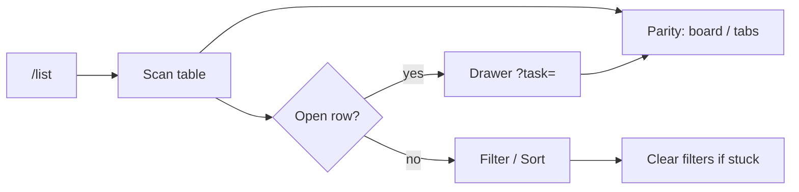

| Stage | Touchpoint | Action | Thought / Emotion | Pain to avoid | Opportunity |
|---|---|---|---|---|---|
| Trigger | Lands on main workspace after onboarding or bookmark | Scrolls to see all open work in one columnar list | "Show me the honest queue." | Empty chrome with no tasks; having to hunt multiple projects | Default land on dense list with status + assignee visible without configuration |
| Orient | List header, sort indicators, row chips | Scans columns for title, status, assignee, priority | "I can parse this in one pass." | Hidden ownership; cryptic status icons | Opinionated column visibility matching founder brief (dense, dark, professional) |
| Act | List row hover / row menu | Opens detail when needed; otherwise stays in list for triage | "Stay shallow until I must go deep." | Forced navigation to edit trivial fields | Inline affordances for status (see inline status feature) and clear row click target for detail |
| Confirm | Same list after teammate moves a card on board | Sees status/assignee update without refresh | "We share one truth." | Stale row after board update (parity failure) | Real-time or instant revalidation; same task ids across views |
| Recover / Next | Mis-sorted or overwhelming list | Changes sort (see sort feature) or applies filters | "Let me narrow without losing context." | Dead end after filter (zero results with no guidance) | Clear empty filter state + one-click reset |

### Feature: Quick add task — Task Inbox/List

- **Label:** core
- **Primary persona:** Priya Nair — captures client asks mid-review without breaking flow.
- **JTBD refs:** #2 (fast capture at start of day); #3 (low ceremony vs enterprise create dialogs)

**Happy path (interactions)**

1. On **`/list`**, click **`+`** / quick-add control in the list header (sitemap: top inline quick-add).
2. Quick-add row or popover opens; focus in **title** field.
3. Type title; optionally set **assignee** / **status** if shown (defaults: To do, self when solo).
4. Submit with **Enter** and/or primary **Create** (exact primary label TBD).
5. New task row appears in the list (optimistic); URL stays **`/list`** unless you deep-link elsewhere.
6. Confirm the same task appears on **`/board`** without refresh (parity).

**Edge / recover**

- Empty title on submit → inline validation; no new row.
- Mistyped title after create → click row → drawer **`/list?task=[id]`** → edit title (autosave).

**Interaction flow (Mermaid)**

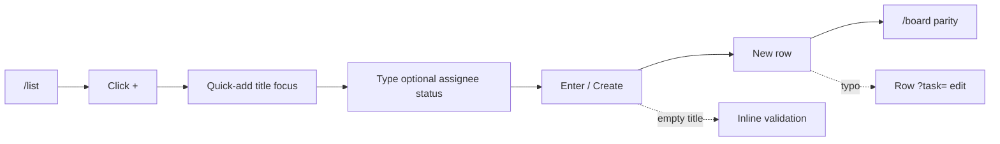

| Stage | Touchpoint | Action | Thought / Emotion | Pain to avoid | Opportunity |
|---|---|---|---|---|---|
| Trigger | List top bar or persistent "+" | Decides to log new deliverable while on a call | "If I don’t capture this now, it lives in Slack." | Buried create button; modal with 12 fields | Single obvious quick-add anchored to list |
| Orient | Quick-add popover / inline row | Sees title required; defaults for status/assignee | "Defaults should match how we work." | Forcing project/folder picks (out of scope guardrail) | Default To do + self assign when solo; minimal required fields |
| Act | Quick-add surface | Types title, optional assignee/status, commits | "One breath, one task." | Network lag with no optimistic row | Optimistic insert row; validate title non-empty |
| Confirm | List body | New row appears in unified list with chips | "It’s real, not a draft somewhere." | Task created in a hidden view | Scroll/focus to new row subtly; parity so board shows same card |
| Recover / Next | Mistyped title | Opens detail from new row or undo if offered | "Let me fix without shame." | Hard delete only; no path to edit | Soft focus title in detail; archive vs delete per brief |

### Feature: Inline status update from list — Task Inbox/List

- **Label:** core
- **Primary persona:** Miguel Santos — updates status without leaving keyboard flow.
- **JTBD refs:** #5 (fast status move before deadline; stays in sync with board/detail)

**Happy path (interactions)**

1. On **`/list`**, locate the task row.
2. Click the **status chip** / control on the row (not the whole row, if that opens detail).
3. In the inline menu, choose **To do**, **In progress**, or **Done** (MVP fixed set).
4. Selection applies immediately (no separate Save).
5. Confirm chip updates on the row; if **`/board`** or drawer is open, same task updates there.

**Edge / recover**

- Wrong status picked → open chip again → pick correct status.
- Mutation fails → chip rolls back + toast; retry from row.

**Interaction flow (Mermaid)**

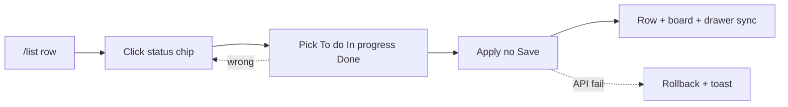

| Stage | Touchpoint | Action | Thought / Emotion | Pain to avoid | Opportunity |
|---|---|---|---|---|---|
| Trigger | Row shows in-progress client patch still in To do | Opens status control from list | "Don’t make me open a panel." | Only editable in detail | Status chip/dropdown always visible on desktop row |
| Orient | Inline status menu on row | Sees exactly three statuses (MVP) | "Matches the board mental model." | Surprise custom statuses in MVP | Locked labels To do / In progress / Done |
| Act | Dropdown or cycle control | Selects In progress | "Done." | Two-step confirm for non-destructive change | Single select applies; no save button |
| Confirm | Row + board (if open elsewhere) | Chip updates; board column reflects | "Parity holds." | Board lags list | Same mutation updates all subscribers |
| Recover / Next | Wrong column intent | Picks correct status again | Mild annoyance | No audit of who changed what when debugging handoffs | Lightweight updated-at + optional activity in detail |

### Feature: Filter by status/assignee/priority — Task Inbox/List

- **Label:** supporting
- **Primary persona:** Jordan Reyes — pre-milestone slice: "what does this contractor owe?"
- **JTBD refs:** #2 (narrow to execution context); #4 (clarity for micro-team without dashboards)

**Happy path (interactions)**

1. On **`/list`**, click **Filter** in the list toolbar.
2. In the filter popover, multi-select **status**, **assignee**, and/or **priority** (AND logic).
3. Apply; list (and URL query `?status=&assignee=&priority=`) updates to the subset.
4. Scan reduced rows; optional live count in UI when shipped.
5. Understand relationship to **`/board`**: either same filters apply or UI states board is unfiltered (product rule).

**Edge / recover**

- Zero results → zero-state copy + **Clear all filters**.
- Board and list feel inconsistent → toggle “filters apply to board” or read inline explainer per spec.

**Interaction flow (Mermaid)**

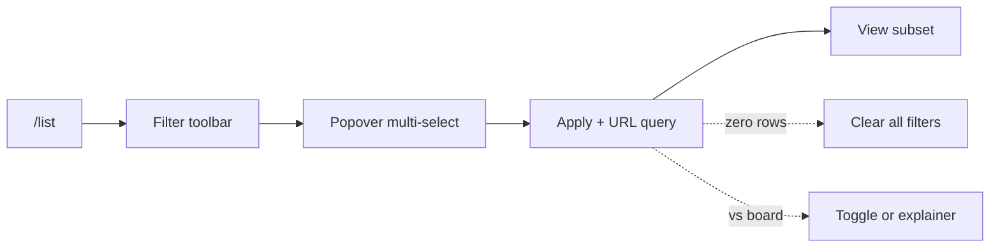

| Stage | Touchpoint | Action | Thought / Emotion | Pain to avoid | Opportunity |
|---|---|---|---|---|---|
| Trigger | List grows past ~15 mixed-client tasks | Opens filter control in list toolbar | "I only care about In progress + Alex today." | Export to spreadsheet workaround | Filter chips persistent but dismissible |
| Orient | Filter popover | Sees triad: status, assignee, priority | "Obvious AND logic." | Advanced query language | Simple multi-select with live result count |
| Act | Applies assignee + status | List re-renders subset | "This is my stand-up subset." | Full-page reload flash | Client-side or snappy server filter; preserve sort |
| Confirm | Row set + optional board sidecar | Only matching tasks visible; counts make sense | Trust | Board shows superset while list filtered — feels broken | Optional "filter applies to board" toggle or clear messaging |
| Recover / Next | Over-filtered to zero | Clears one chip at a time | "Where did everything go?" | Blank screen with no CTA | Zero-state copy + "clear all filters" |

### Feature: Sort by due date/priority/updated time — Task Inbox/List

- **Label:** supporting
- **Primary persona:** Miguel Santos — starts deep-work block with highest leverage thread.
- **JTBD refs:** #2 (re-order workload for execution clarity)

**Happy path (interactions)**

1. On **`/list`**, open **Sort** in the list toolbar.
2. Choose sort key: **due date**, **priority**, or **updated** (+ direction per control).
3. List reorders; URL `sort=` reflects choice.
4. Scan top of list for “next work” (e.g. due ascending).
5. Tasks with null due date: expect **nulls last** + hint to add dates when sorting by due.

**Edge / recover**

- Wrong sort → open Sort again → pick another key (remember last choice per user when shipped).
- Dates look wrong → verify workspace timezone under **`/settings/workspace`**.

**Interaction flow (Mermaid)**

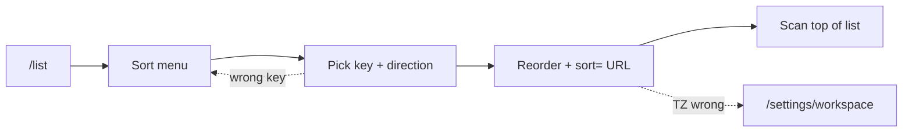

| Stage | Touchpoint | Action | Thought / Emotion | Pain to avoid | Opportunity |
|---|---|---|---|---|---|
| Trigger | Deadline morning | Opens sort menu on list | "What’s due soonest?" | Fixed arbitrary ordering | Expose due date / priority / updated sort |
| Orient | Sort dropdown | Reads current selection + options | "Predictable semantics." | Unclear ascending vs descending | Label arrows + persistent indicator in header |
| Act | Chooses due date ascending | List reorders | "Top is next fire." | Tasks without dates vanish or sort randomly | Explicit handling: nulls last + inline hint to add dates |
| Confirm | Rows animate or stable reorder | Scans top of list | Confidence | Sort appears changed but field wrong (timezone) | Respect workspace timezone from settings |
| Recover / Next | Wrong sort choice | Switches to updated time | Quick correction | No way back to prior sort | Remember last sort per user locally |

### Feature: Keyboard command quick capture — Task Inbox/List

- **Label:** nice-to-have
- **Primary persona:** Miguel Santos — expects desktop shortcuts; minimal mouse.
- **JTBD refs:** #2 (capture without leaving flow)

**Happy path (interactions)**

1. **Post-MVP:** when shipped, from desktop with app focused, press global shortcut (TBD, conflict-free).
2. Quick-add surface focuses **title**.
3. Type title → **Enter** to create (same as mouse quick-add commit).
4. Confirm new row on **`/list`**.

**Edge / recover**

- Shortcut not built yet → use **`+`** quick-add only; no dead shortcut in empty state until shipped.
- App not focused → shortcut does nothing; click app then **`+`**.

**Interaction flow (Mermaid)**

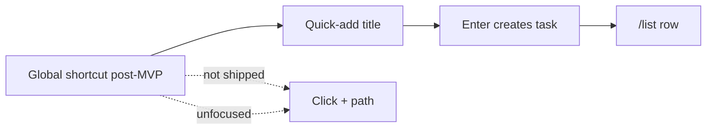

| Stage | Touchpoint | Action | Thought / Emotion | Pain to avoid | Opportunity |
|---|---|---|---|---|---|
| Trigger | Mid-typing in IDE or email | Hits global shortcut (when implemented) | "Open capture now." | Shortcut conflicts with OS/browser | **Post-MVP** per modules-features §4; document conflict-free default when shipped |
| Orient | Quick-add focused | Cursor in title field | "I’m already typing." | Focus trap stealing keys from wrong app | Only registers when app focused unless extension later |
| Act | Types title, Enter to save | Task created | Flow | Silent failure on Enter | Toast or row insert confirmation |
| Confirm | List updates | Sees task | Satisfaction | Parity miss | Same as quick add parity rules |
| Recover / Next | Shortcut not wired yet | Uses mouse quick add | "Fine for now." | Dead shortcut advertised in empty state | Gate hint in settings/help until feature ships |

### Feature: Three default status columns — Status Board

- **Label:** core
- **Primary persona:** Priya Nair — board is pipeline ritual for studio.
- **JTBD refs:** #3 (To do / In progress / Done without hierarchy theater); #5 (deadline alignment)

**Happy path (interactions)**

1. Click **Board** in the left sidebar → land on **`/board`**.
2. See exactly three columns: **To do**, **In progress**, **Done** (labels match list statuses).
3. Scan cards per column; optional column counts when shipped.
4. No column setup before first card — columns are pre-built.

**Edge / recover**

- Want custom status → not MVP; use title prefix / comment convention; feedback link from read-only explainer on **`/settings/workspace`**.

**Interaction flow (Mermaid)**

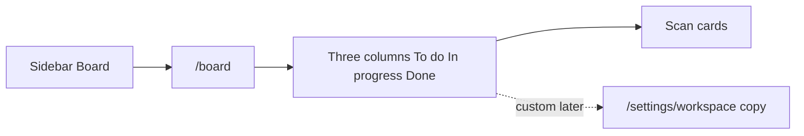

| Stage | Touchpoint | Action | Thought / Emotion | Pain to avoid | Opportunity |
|---|---|---|---|---|---|
| Trigger | Switches nav to Board | Views columns | "This is our motion." | Custom column setup before first card | Pre-built three columns matching statuses |
| Orient | Column headers + WIP visual density | Maps cards to stages | Calm | Mislabeled columns vs list statuses | Strict naming parity with task model |
| Act | Reads cards per column | Plans moves (pairs with drag feature) | "In progress isn’t a junk drawer." | Unlimited columns causing scatter | Fixed three in MVP per guardrail |
| Confirm | Card counts per column | Validates load balance | "We see overload." | No counts | Optional column counts (lightweight) |
| Recover / Next | Needs future custom status | Notes limitation | Pragmatic | Selling enterprise configurability in MVP | **Opportunity:** status configuration is nice-to-have/post roadmap — link to feedback not settings maze |

### Feature: Drag-and-drop status move — Status Board

- **Label:** core
- **Primary persona:** Priya Nair — moves creative tasks visually before client review.
- **JTBD refs:** #5 (drag board that syncs with list/detail)

**Happy path (interactions)**

1. On **`/board`**, pointer-down on a **card** in one column.
2. Drag; watch column **drop highlights** + ghost.
3. Release over target column (**To do** / **In progress** / **Done**).
4. Card animates into column; status persists (optimistic, then confirmed).
5. Confirm **`/list`** row and **`?task=`** drawer show the same status.

**Edge / recover**

- Missed drop / invalid → card snaps back (no status change).
- API error → rollback + toast.
- Wrong column → drag card back or change status from **`/list`** inline chip.
- Keyboard-only path → use list inline status or detail when drag alternative exists.

**Interaction flow (Mermaid)**

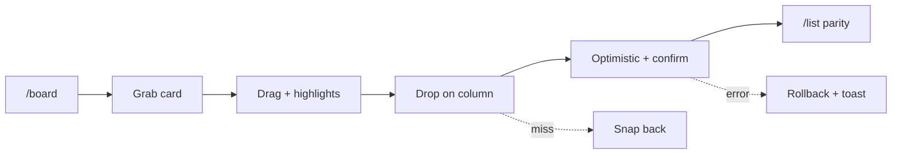

| Stage | Touchpoint | Action | Thought / Emotion | Pain to avoid | Opportunity |
|---|---|---|---|---|---|
| Trigger | Stand-up or async review on board | Grabs card | "Move means progress." | Drag disabled on desktop | Hit targets meet WCAG AA intent per brief |
| Orient | Column drop zones highlight | Sees ghost card | "I know where it lands." | Ambiguous drop between columns | Strong column affordance; keyboard alternative path if drag fails |
| Act | Drops in In progress | Releases pointer | "State changed." | Long request; card snaps back mysteriously | Optimistic UI + rollback toast on error |
| Confirm | Board + list + detail | Status chip everywhere updates | Trust | Any view stale | Single source of truth write |
| Recover / Next | Dropped wrong column | Drags back or uses inline list | Low cost | Accidental archive | Prefer status change over destructive gestures |

### Feature: Board/list/detail parity sync — Status Board

- **Label:** core
- **Primary persona:** Jordan Reyes — contractor on board, Jordan on list.
- **JTBD refs:** #5 (same tasks/statuses/owners); #2 (single picture)

**Happy path (interactions)**

1. Open **`/list`** in one tab and **`/board`** in another (or list + drawer).
2. On either surface, change a field (e.g. assignee in **`/list?task=[id]`** drawer).
3. Switch focus to the other surface without full reload when possible.
4. Confirm same **task id** shows identical **status** and **assignee** (and other surfaced fields).

**Edge / recover**

- Stale UI after idle → tab refocus triggers refetch when implemented.
- Concurrent edit conflict → toast + soft refetch; rare last-write-wins per server rules.

**Interaction flow (Mermaid)**

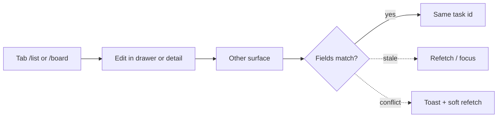

| Stage | Touchpoint | Action | Thought / Emotion | Pain to avoid | Opportunity |
|---|---|---|---|---|---|
| Trigger | Two surfaces open in tabs | Expects mirrored truth | "No debates about which screen lies." | Split-brain tools | Document parity as invariant in UI tests |
| Orient | Any view after mutation | Checks other tab | Vigilance | Needing manual refresh | Websocket/poll/revalidate on focus |
| Act | Updates assignee in detail | Watches list/board | "Propagates." | Partial field sync (status yes, assignee no) | Uniform mutation pipeline for task fields |
| Confirm | All surfaces show same assignee/status | — | Relief | Race: last-write wins without surfacing conflict | Timestamp conflict rare; show toast if rejected |
| Recover / Next | Stale cache edge | Refreshes page | Annoyance if frequent | No hard refresh story | Soft refetch button in toolbar |

### Feature: Swimlane/group by assignee — Status Board

- **Label:** supporting
- **Primary persona:** Jordan Reyes — sees per-person load inside each status.
- **JTBD refs:** #1 (who owes what without seat overhead); #5 (deadline coordination)

**Happy path (interactions)**

1. On **`/board`**, turn on **Group by assignee** (sets `?group=assignee` in sitemap).
2. Within each status column, read **lanes**: owner first, then A–Z, plus **Unassigned**.
3. Move work: either **drag card** to another lane if product allows, or open card/detail and change **assignee**.
4. Confirm **`/list`** and drawer show the same assignee chip.
5. Turn grouping **off** to return to a flat column view.

**Edge / recover**

- Lane count overwhelming → toggle group off from the same control near List/Board switch.

**Interaction flow (Mermaid)**

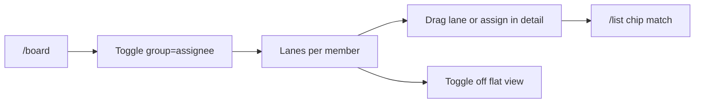

| Stage | Touchpoint | Action | Thought / Emotion | Pain to avoid | Opportunity |
|---|---|---|---|---|---|
| Trigger | Multiple contractors active | Toggles group-by assignee on board | "Whose In progress is bloated?" | Only manual scanning | MVP-essential per modules-features §4 |
| Orient | Lanes labeled by member + unassigned | Reads matrix | "Spatial clarity." | Lanes reorder randomly | Stable member sort (owner first, alphabetical) |
| Act | Drags card across lane boundary if supported, or reassigns | Updates ownership | "Rebalance work." | Drag breaks assignee semantics | Explicit assignee change action if cross-lane drag ambiguous |
| Confirm | List/detail assignee matches lane | — | Control | Lane shows old owner | Same parity pipeline |
| Recover / Next | Too many lanes | Turns grouping off | "Back to simple board." | Toggle buried | Prominent view option next to board/list switch |

### Feature: WIP limit indicators — Status Board

- **Label:** nice-to-have
- **Primary persona:** Miguel Santos — wants gentle overload signal without enterprise WIP config.
- **JTBD refs:** #2 (execution clarity); #5 (pre-deadline triage)

**Happy path (interactions)**

1. **Post-MVP:** on **`/board`**, glance at **In progress** column header/badge when soft WIP shipped.
2. Read advisory signal (e.g. tint / count vs threshold); no hard block.
3. Team drags cards to **Done** to bring count under hint.

**Edge / recover**

- Not in MVP build → ignore; do not gate drag on WIP.
- Signal feels wrong → ignore or hide per workspace when that setting exists.

**Interaction flow (Mermaid)**

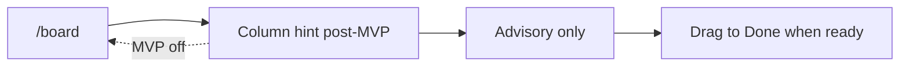

| Stage | Touchpoint | Action | Thought / Emotion | Pain to avoid | Opportunity |
|---|---|---|---|---|---|
| Trigger | In progress column feels heavy | Notices soft threshold styling (when shipped) | "We should finish before starting." | **Post-MVP** per §4 backlog — avoid blocking MVP board | Ship as visual-only hint first: column tint when count > N |
| Orient | Column header badge | Reads count vs limit | "Numerate overload." | Arbitrary limits with no tuning | Sensible default N with tooltip |
| Act | Team throttles new pulls | Moves cards to Done | Discipline | Hard enforcement (out of scope) | Advisory-only to match anti-bloat |
| Confirm | Indicator clears when under limit | — | Calm | Indicator wrong vs actual count | Derive from live query |
| Recover / Next | Limit feels wrong for team | Ignores indicator | Pragmatic | No dismiss | Optional hide per workspace (later) |

### Feature: Core task fields (title, description) — Task Detail

- **Label:** core
- **Primary persona:** Priya Nair — writes creative brief fragments on the task.
- **JTBD refs:** #3 (task identity without wiki); #4 (client-ready clarity)

**Happy path (interactions)**

1. From **`/list`** or **`/board`**, click task row/card → **`?task=[id]`** drawer **or** open **`/tasks/[taskId]`** from a link.
2. In detail header/body, focus **title** and/or **description** (plain text MVP).
3. Type edits; wait for **debounced autosave** (or explicit save if that’s the shipped pattern).
4. Confirm **Saved** / relative saved time in chrome.

**Edge / recover**

- Save fails → inline **Retry** from error banner.
- Opened wrong task → **Esc** closes drawer or **Back** from full page → return to list/board.

**Interaction flow (Mermaid)**

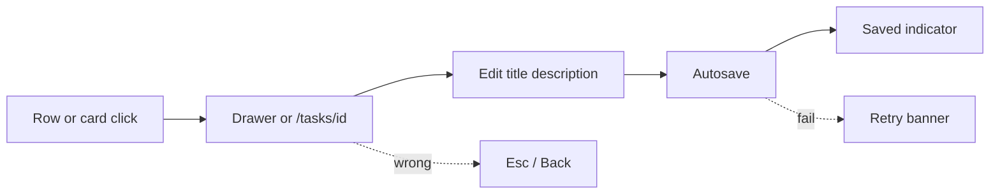

| Stage | Touchpoint | Action | Thought / Emotion | Pain to avoid | Opportunity |
|---|---|---|---|---|---|
| Trigger | Clicks row from list/board | Detail panel/page opens | "Context lives here." | Full navigation away losing list position | Split pane or overlay preserving list scroll |
| Orient | Title + description editor | Sees current content | "Plain is fine." | Rich-text bugs in MVP | Plain text MVP per founder brief |
| Act | Edits title/description; autosave or save | Types deliverable notes | "Autosave or obvious save?" | Data loss on blur | Debounced autosave + last-saved indicator |
| Confirm | Toast or inline "Saved" | — | Trust | Silent fail | Error banner with retry |
| Recover / Next | Wrong task opened | Uses breadcrumb/back to list | Low friction | No back gesture | Esc to close detail overlay |

### Feature: Assignee and priority — Task Detail

- **Label:** core
- **Primary persona:** Jordan Reyes — assigns rotating contractor.
- **JTBD refs:** #1 (shared assignees without seat drama); #4 (urgency + ownership visible)

**Happy path (interactions)**

1. Open task detail (drawer **`/list?task=[id]`** / **`/board?task=[id]`** or **`/tasks/[id]`**).
2. Open **Assignee** dropdown → pick a workspace **member** (MVP: members only).
3. Set **Priority** control to the desired level.
4. Confirm autosave (or save) and updated chips on list/board behind the drawer.

**Edge / recover**

- Wrong assignee → reopen dropdown → pick another member.

**Interaction flow (Mermaid)**

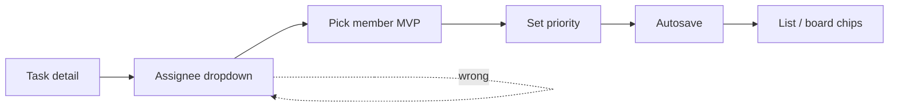

| Stage | Touchpoint | Action | Thought / Emotion | Pain to avoid | Opportunity |
|---|---|---|---|---|---|
| Trigger | Task needs owner before stand-up | Opens detail | "Who’s on the hook?" | Assignee picker empty | Seed workspace members in picker |
| Orient | Assignee dropdown + priority control | Sees self + teammates | "Simple enum." | Role jargon | Owner/member both assignable per micro-team model |
| Act | Picks assignee + High priority | Saves | "They’ll see it." | Requires re-invite to assign | Guest assignee rules deferred — only members MVP |
| Confirm | List/board chips update | — | Confidence | Priority invisible on board/list | Show priority chip consistently where spec demands |
| Recover / Next | Picked wrong person | Reassigns | Quick fix | Audit trail missing | Comment ping optional later |

### Feature: Due date — Task Detail

- **Label:** supporting
- **Primary persona:** Priya Nair — ties tasks to client review dates.
- **JTBD refs:** #5 (deadline / invoice window planning)

**Happy path (interactions)**

1. Open task detail.
2. Click **Due date** control → date picker opens (workspace timezone per **`/settings/workspace`**).
3. Pick a date or **clear** date.
4. Confirm compact due label on **`/list`** row when sorted/filtered by due.

**Edge / recover**

- Client changes date → reopen picker and adjust.

**Interaction flow (Mermaid)**

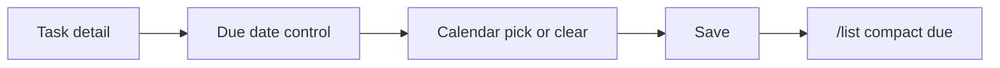

| Stage | Touchpoint | Action | Thought / Emotion | Pain to avoid | Opportunity |
|---|---|---|---|---|---|
| Trigger | Client sends date | Opens detail date field | "This drives sort." | Date buried | Datepicker near title block |
| Orient | Calendar popover | Sees timezone-aware day | "No UTC surprises." | Wrong timezone | Workspace timezone from settings |
| Act | Picks date; clears optional | Saves | "Nullable is OK." | Forced date on every task | Allow clear date |
| Confirm | List sort by due works | Row shows compact date | Visibility | Date not shown on list | Compact due label on row per MVP essential |
| Recover / Next | Date moved by client | Edits inline or detail | Adaptation | Versioning dates | Comment "date changed" optional |

### Feature: Image attachment upload — Task Detail

- **Label:** supporting
- **Primary persona:** Priya Nair — attaches mockups for campaign tasks.
- **JTBD refs:** #4 (visual proof for creative delivery)

**Happy path (interactions)**

1. Open task detail → scroll to **Attachments** / image section.
2. Click **dropzone** or **Choose file** → pick image within allowed type/size.
3. Watch **progress**; optional **Cancel** while uploading.
4. Confirm **thumbnail** in grid; click to **lightbox** preview.

**Edge / recover**

- Upload fails (size/network) → error + **Retry**.
- Wrong file → **Delete** attachment → confirm dialog when shipped.

**Interaction flow (Mermaid)**

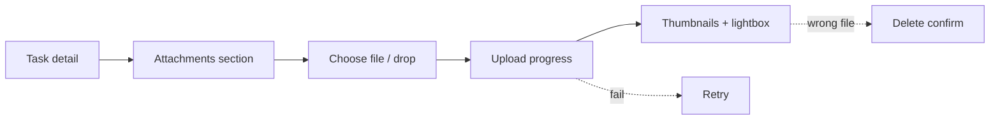

| Stage | Touchpoint | Action | Thought / Emotion | Pain to avoid | Opportunity |
|---|---|---|---|---|---|
| Trigger | Needs reference on task | Scrolls to attachments | "Boards aren’t Figma." | Out-of-scope video | Images only per brief |
| Orient | Upload dropzone + file picker | Sees size/type limits (5MB etc.) | "Fair guardrails." | Opaque failure | Presigned upload progress |
| Act | Selects PNG | Uploads | "Did it stick?" | Long hang no progress | Progress bar + cancel |
| Confirm | Thumbnail grid | Opens lightbox | "Client-facing proof." | Broken thumbnail | Retry upload affordance |
| Recover / Next | Wrong file | Deletes attachment | Clean slate | Accidental delete no confirm | Soft confirm delete |

### Feature: Task comments/activity trail (lightweight) — Task Detail

- **Label:** supporting
- **Primary persona:** Miguel Santos — async handoff with partner without Slack.
- **JTBD refs:** #1 (collaboration context); #5 (closure before deadline)

**Happy path (interactions)**

1. Open task detail → scroll to **Comments**.
2. Read thread (chronological; author + time).
3. Type in composer → click **Send** / submit.
4. See new comment append (optimistic bubble until confirmed).

**Edge / recover**

- Typo shortly after send → **Edit** within short window or **Delete** per MVP rules.
- Send fails → error on bubble + **Retry**.

**Interaction flow (Mermaid)**

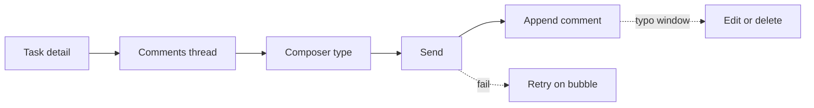

| Stage | Touchpoint | Action | Thought / Emotion | Pain to avoid | Opportunity |
|---|---|---|---|---|---|
| Trigger | Blocker note after deploy | Opens detail comments | "Keep it near the task." | Thread in Slack only | Comment stream anchored to task |
| Orient | Chronological list | Sees author + timestamp | "Lightweight, not Jira." | Full activity graph | Text comments MVP; system events minimal |
| Act | Types comment; submit | Adds @mention if supported later | "They’ll read this here." | **MVP:** plain comments without complex mentions | Start simple; mentions post roadmap |
| Confirm | Comment appears top/bottom consistent | — | Trust | Ordering bugs | Stable sort (oldest/newest toggle optional) |
| Recover / Next | Typo | Edit window or delete | Low shame | No edit | Allow short edit window |

### Feature: Subtasks/checklist — Task Detail

- **Label:** nice-to-have
- **Primary persona:** Priya Nair — breaks campaign task into asset checklist.
- **JTBD refs:** #4 (mini steps without full project hierarchy)

**Happy path (interactions)**

1. **Post-MVP:** open task detail → expand **Subtasks / checklist** section when shipped.
2. Add checklist lines; check/uncheck items.
3. See progress on parent (optional list row chip when shipped).

**Edge / recover**

- MVP without subtasks → use **description** headings / bullets as workaround.

**Interaction flow (Mermaid)**

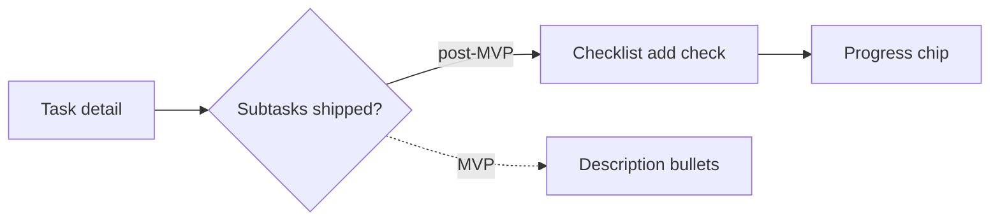

| Stage | Touchpoint | Action | Thought / Emotion | Pain to avoid | Opportunity |
|---|---|---|---|---|---|
| Trigger | Large deliverable in one card | Expands subtasks (when shipped) | "Checklist beats new cards." | **Post-MVP** per §4 | Keep description headings as MVP workaround in copy |
| Orient | Checklist UI | Sees progress % | Motivation | Nested sub-subtasks | One level only |
| Act | Adds items; checks done | Updates progress | "Micro wins." | Checklist doesn’t affect status | Optional "all done suggests move to Done" later |
| Confirm | Parent row shows progress chip | Teammate sees | Alignment | Parity: optional mirror on list row | Collapsed count on list |
| Recover / Next | Checklist too long | Collapses section | Focus | Performance drag | Virtualize long lists later |

### Feature: Invite teammate by email/link — Team & Access

- **Label:** core
- **Primary persona:** Jordan Reyes — invites 2-week contractor.
- **JTBD refs:** #1 (same list/board without extra paid seat elsewhere)

**Happy path (interactions)**

1. Open **`/settings/team`** (sidebar **Team** / empty-state CTA per sitemap).
2. Click **Invite** (or equivalent).
3. In modal: choose **email invite** and/or **copy invite link**; verify workspace name + inviter shown.
4. Submit send or copy link → share out-of-band.
5. Confirm **pending invite** row appears in team table.

**Edge / recover**

- Wrong email → **Revoke** + create new invite (owner).
- Rate-limited resend → wait for cooldown copy.

**Interaction flow (Mermaid)**

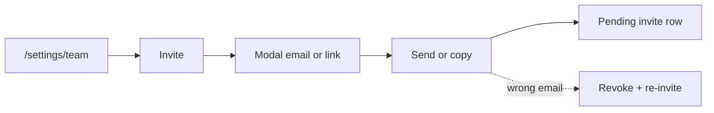

| Stage | Touchpoint | Action | Thought / Emotion | Pain to avoid | Opportunity |
|---|---|---|---|---|---|
| Trigger | New engagement starts | Opens invite from workspace menu | "Fast invite, no procurement." | Hidden invite | Always-visible team entry |
| Orient | Invite modal | Chooses email vs link | "They’ll know what they’re joining." | Opaque workspace name | Show workspace name + inviter |
| Act | Sends invite | Copies link or emails | "They’re in." | CAPTCHA hell on collaborator | Smooth magic-link pattern per brief posture |
| Confirm | Pending member appears | — | Expectation | No pending state | Join-state clarity feature complements |
| Recover / Next | Wrong email | Revokes/resends | Fix | Cannot revoke invite | Expire + resend |

### Feature: Simple member roles (owner/member) — Team & Access

- **Label:** supporting
- **Primary persona:** Miguel Santos — one owner, partner as member.
- **JTBD refs:** #1 (minimal governance)

**Happy path (interactions)**

1. As **owner**, open **`/settings/team`**.
2. Locate member row → open **role** control (Owner vs Member).
3. If demoting/promoting, confirm in **modal** when required.
4. Confirm badge updates; member’s task permissions follow MVP rule (members edit tasks).

**Edge / recover**

- Member row should not expose owner-only actions → read-only or hidden per role.
- Cannot remove last owner → blocked with explainer.

**Interaction flow (Mermaid)**

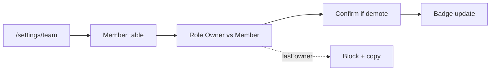

| Stage | Touchpoint | Action | Thought / Emotion | Pain to avoid | Opportunity |
|---|---|---|---|---|---|
| Trigger | First collaborator accepts | Owner checks permissions | "Who can break things?" | RBAC matrix | Binary owner vs member |
| Orient | Team settings table | Sees role column | "Obvious." | Enterprise roles (admin/editor/viewer stack) | Only two labels |
| Act | Promotes/demotes if ever needed | Changes role | Rare action | Accidental demote locks billing — N/A for donation model | Confirm modal on owner demote |
| Confirm | Role badge updates | Member sees allowed actions | Clarity | Member cannot perform needed task actions | Member full task edit; owner-only billing/settings later |
| Recover / Next | Wrong role | Owner adjusts | Recovery | No owner | Always ≥1 owner invariant |

### Feature: Join-state clarity (pending/accepted/expired invite) — Team & Access

- **Label:** supporting
- **Primary persona:** Jordan Reyes — tracks whether contractor actually joined.
- **JTBD refs:** #1 (visibility without login juggling)

**Happy path (interactions)**

1. Open **`/settings/team`**.
2. Scan **Invites** list: chips for **Pending** / **Accepted** / **Expired** + timestamps/countdown when shipped.
3. For pending: click **Resend** or **Copy link** within rate limits.
4. When invitee accepts, see row flip to **member** with avatar.

**Edge / recover**

- Expired → **Regenerate** / new invite flow per spec.
- Stuck pending after accept → refocus page to poll; support if still broken.

**Interaction flow (Mermaid)**

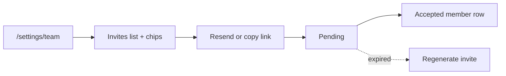

| Stage | Touchpoint | Action | Thought / Emotion | Pain to avoid | Opportunity |
|---|---|---|---|---|---|
| Trigger | Sent invite yesterday | Opens team panel | "Did they click?" | Black hole | Explicit pending/expired chips |
| Orient | Invites list | Reads timestamps | "When to nudge." | No expiry story | Show expiry countdown per invite policy |
| Act | Resends or copies fresh link | Follows up | Pragmatic | Spammy resend | Rate-limit with friendly copy |
| Confirm | State flips to accepted | Avatar appears | Relief | Stuck pending after accept | Webhook-style poll on team panel focus |
| Recover / Next | Expired | One-click regenerate | Fix | Manual support | Self-serve renew invite |

### Feature: Guest/client read-only access — Team & Access

- **Label:** nice-to-have
- **Primary persona:** Priya Nair — wants client to see status without collaborator seat.
- **JTBD refs:** #1 (visibility without seat-tax); #5 (client confidence)

**Happy path (interactions)**

1. **Post-MVP:** from share entry point, open **Share read-only** dialog.
2. Generate **client link** with read-only badge visible in UI.
3. **Copy link** → send to client.
4. Client opens link → **`/list`** / **`/board`** (or scoped view) in read-only mode.

**Edge / recover**

- MVP: no client link → export/screenshot workaround from marketing copy.
- Revoke access → **Revoke token** in list when shipped.

**Interaction flow (Mermaid)**

```mermaid
flowchart LR
  X{Post-MVP} --> SH[Share read-only]
  SH --> L[Copy client link]
  L --> V[Client read-only view]
  SH -.->|MVP| SS[Screenshot export]
```

| Stage | Touchpoint | Action | Thought / Emotion | Pain to avoid | Opportunity |
|---|---|---|---|---|---|
| Trigger | Client asks "where are we?" | Considers share link (future) | "Read-only is enough." | **Post-MVP** per §4 | Position in roadmap comms; MVP: export screenshot workaround |
| Orient | Share dialog (future) | Sees read-only badge | Trust | Client edits tasks by accident | Hard server enforced read-only role |
| Act | Copies client link | Sends | "Professional." | Token leak | Expiring tokens |
| Confirm | Client view loads board/list read-only | — | Pride | Parity breaks | Read replica of same views |
| Recover / Next | Client shouldn’t see anymore | Revokes token | Safety | No revoke | Revocation list |

### Feature: Create workspace + first task in <=2 steps — Activation & Onboarding

- **Label:** core
- **Primary persona:** Miguel Santos — evaluates tool in <5 minutes.
- **JTBD refs:** #2 (time-to-truth); #3 (no architecture project)

**Happy path (interactions)**

1. From **`/register`** (or **`/login`**): submit email → complete **magic link** from inbox.
2. First sign-in with no workspace → **`/onboarding/workspace`**: enter **workspace name**, confirm **timezone** → **Continue**.
3. **`/onboarding/first-task`**: enter first **task title** (optional assignee/status per screen) → **Create** (or **Skip**).
4. Land on **`/list`** with task row if created, or checklist empty state if skipped.

**Edge / recover**

- Validation on empty workspace name or empty task title → inline errors.
- Workspace name typo later → **`/settings/workspace`** → rename.

**Interaction flow (Mermaid)**

```mermaid
flowchart LR
  R["/register or /login"] --> M[Magic link]
  M --> W["/onboarding/workspace"]
  W --> F["/onboarding/first-task"]
  F --> C[Create or Skip]
  C --> L["/list"]
  W -.->|validation| W
  F -.->|empty title| F
```

| Stage | Touchpoint | Action | Thought / Emotion | Pain to avoid | Opportunity |
|---|---|---|---|---|---|
| Trigger | Landing from marketing | Starts signup | "Don’t waste my night." | Long forms | Workspace name + user in one flow |
| Orient | Step indicator (max 2) | Sees next is first task | Predictable | Surprise email verify wall | If email verify needed, still ≤2 product steps after auth |
| Act | Names workspace; creates first task title | Submits | "Already useful." | Forced invite before value | Invite deferred to empty state guidance |
| Confirm | Unified list shows task | — | Momentum | Empty state persists incorrectly | Immediate transition to list/board |
| Recover / Next | Typo in workspace name | Renames in settings later | Low regret | Locked forever | Workspace rename in basics settings |

### Feature: First-use empty state guidance — Activation & Onboarding

- **Label:** supporting
- **Primary persona:** Priya Nair — orients studio without admin manual.
- **JTBD refs:** #2 (first minutes on throughput); #3 (low cognitive load)

**Happy path (interactions)**

1. Land on **`/list`** (or **`/board`**) with **zero tasks** and first-use flag.
2. Read compact checklist (max ~3 CTAs): e.g. **Add first task**, **Move a status**, **Invite teammate**.
3. Click each CTA in sequence (or skip invite); each routes to the real control (quick-add, board/list, **`/settings/team`**).
4. After at least one task exists, empty illustration/checklist **dismisses**; if user deletes all tasks, gentle hint may return.

**Edge / recover**

- Skipped invite → open **Team** from sidebar later — no punitive copy.

**Interaction flow (Mermaid)**

```mermaid
flowchart LR
  L["/list empty"] --> E[Empty checklist CTAs]
  E --> A[Add task]
  E --> B[Move status]
  E --> T["Invite Team"]
  A --> D[Dismiss when tasks exist]
  E -.->|skipped invite| T
```

| Stage | Touchpoint | Action | Thought / Emotion | Pain to avoid | Opportunity |
|---|---|---|---|---|---|
| Trigger | Lands on empty workspace | Sees empty list/board | "What now?" | Blank generic template per founder fear | Tailored dark compact empty illustration + 3 CTAs |
| Orient | Checklist: first task, first status move, first invite | Reads short copy | "I can skim." | Essay | Max 3 bullets |
| Act | Clicks suggested actions sequentially | Completes seed actions | "Guided, not babysat." | Forced sample data | Optional template ties to sample project feature |
| Confirm | List/board non-empty | Empty state dismisses | Achievement | Dismiss too aggressive if user deletes all | Re-show gentle hint if zero tasks |
| Recover / Next | Skipped invite | Returns via team menu | OK path | Guilt copy | Positive tone |

### Feature: Sample project template — Activation & Onboarding

- **Label:** nice-to-have
- **Primary persona:** Jordan Reyes — wants freelance-shaped starter tasks.
- **JTBD refs:** #2 (faster orientation); #4 (credible structure)

**Happy path (interactions)**

1. **Post-MVP:** on empty state, click **Use template** when shipped.
2. Pick preset (e.g. one freelance starter).
3. Confirm tasks inserted; optional **demo tasks** banner + bulk delete.

**Edge / recover**

- Until shipped → only manual **Add task** from empty state.

**Interaction flow (Mermaid)**

```mermaid
flowchart LR
  E[Empty state] --> X{Template shipped?}
  X -->|yes| P[Pick preset]
  P --> I[Insert tasks]
  X -.->|MVP| M[Manual add task]
```

| Stage | Touchpoint | Action | Thought / Emotion | Pain to avoid | Opportunity |
|---|---|---|---|---|---|
| Trigger | Empty state "use template" | Clicks | "Show me conventions." | **Post-MVP** per §4 | Until shipped, link to manual first task only |
| Orient | Template picker | Sees 1–2 simple presets | Not overwhelming | 20 templates | One freelance default |
| Act | Applies template | Board fills | "I’ll rename, not rebuild." | Pollutes production with fake clients | Clear "demo tasks" banner with bulk delete |
| Confirm | Tasks editable/deletable | — | Control | Locked demo | All real tasks post-insert |
| Recover / Next | Chose wrong template | Deletes batch | Cleanup | No multi-select | Multi-select delete later |

### Feature: Workspace basics (name, timezone) — Light Settings & Trust

- **Label:** supporting
- **Primary persona:** Jordan Reyes — EU clients + US work; timezone correctness for due dates.
- **JTBD refs:** #1 (coordination); #5 (deadline truth)

**Happy path (interactions)**

1. Avatar / **Settings** → **`/settings/workspace`** (owner only for edits).
2. Edit **Workspace name** and/or **Timezone** fields.
3. **Save** (or autosave with feedback per implementation).
4. Return to **`/list`** and confirm due labels / sorts respect new timezone.

**Edge / recover**

- Member hits page → **Owner only** locked card / read-only per sitemap.
- Invalid name → inline validation before save.

**Interaction flow (Mermaid)**

```mermaid
flowchart LR
  A[Avatar Settings] --> W["/settings/workspace"]
  W --> E[Edit name timezone]
  E --> S[Save]
  S --> L["/list due labels"]
  W -.->|member| RO[Owner only locked]
```

| Stage | Touchpoint | Action | Thought / Emotion | Pain to avoid | Opportunity |
|---|---|---|---|---|---|
| Trigger | Due dates look off | Opens settings | "Fix the basics." | Settings maze | Small settings surface |
| Orient | Name + timezone fields | Sees current values | "Only what matters." | 50 toggles | Single page section |
| Act | Updates timezone; saves | Confirms | "Dates should align." | Silent apply | Explicit save or autosave with feedback |
| Confirm | Due labels re-render | — | Relief | Old cached dates | Invalidate client cache on TZ change |
| Recover / Next | Broke name | Reverts edit | Low stakes | No undo | Inline validation |

### Feature: Status configuration (locked in MVP, extensible later) — Light Settings & Trust

- **Label:** nice-to-have
- **Primary persona:** Priya Nair — may want Client review later; not MVP.
- **JTBD refs:** #3 (future flexibility); #5 (workflow fit)

**Happy path (interactions)**

1. Open **`/settings/workspace`**.
2. Read **read-only** explainer: three statuses locked for MVP.
3. Optional: click **Send feedback** / link to request future columns.

**Edge / recover**

- Need “Client review” today → use **title prefix** or **comment** convention; no hidden fourth column toggle.

**Interaction flow (Mermaid)**

```mermaid
flowchart LR
  W["/settings/workspace"] --> R[Read-only 3 statuses]
  R --> F[Feedback link optional]
  R -.->|need extra stage| C[Title prefix convention]
```

| Stage | Touchpoint | Action | Thought / Emotion | Pain to avoid | Opportunity |
|---|---|---|---|---|---|
| Trigger | Wants fourth column someday | Visits settings (future) | "Later." | **MVP locked** per modules-features + founder brief defaults | Show read-only explanation of three statuses |
| Orient | Disabled or absent editor | Reads "locked for MVP" | Acceptance | Teasing nonfunctional toggle | Honest copy + feedback link |
| Act | Sends feedback | Submits short request | "I’ll wait for a real migration path." | False hope that toggles work today | Capture request; don’t pretend config exists |
| Confirm | Read-only status explainer remains accurate | Closes settings | "At least they’re honest." | Drift between copy and product (e.g. hidden fourth column) | Keep copy versioned with releases |
| Recover / Next | Needs Client review now | Uses task title prefix or comment convention | Pragmatic | Forcing custom status in MVP | Document lightweight naming patterns internally |

### Feature: Non-blocking donation reminder — Light Settings & Trust

- **Label:** supporting
- **Primary persona:** Priya Nair — tolerant if dismissible and tasteful.
- **JTBD refs:** #1 (free core collaboration); #3 (trust without paywall)

**Happy path (interactions)**

1. On session milestone (or time-based rule), **banner/modal** surfaces donation ask.
2. Read neutral copy → click **Dismiss** to continue task work unblocked.
3. Or click **Donate** → external flow → return to app.
4. Optional: open **`/settings/donation`** later to donate or tune reminder cadence.

**Edge / recover**

- Dismiss should not reappear aggressively; cooldown per policy.

**Interaction flow (Mermaid)**

```mermaid
flowchart LR
  M[Session milestone] --> B[Banner or modal]
  B --> D[Dismiss]
  B --> N[Donate external]
  D --> W[Continue tasks]
  N --> W
  W --> S["/settings/donation later"]
```

| Stage | Touchpoint | Action | Thought / Emotion | Pain to avoid | Opportunity |
|---|---|---|---|---|---|
| Trigger | Session milestone or time-based | Modal/banner surfaces | "Here it comes." | Blocking modal | Dismiss continues work per brief |
| Orient | Copy explains optional support | Reads once | "Fair." | Guilt manipulation | Neutral tone; no dark patterns |
| Act | Dismisses or donates | Chooses | Autonomy | Paywall on features | Never gate task actions |
| Confirm | Banner stays dismissed per policy | — | Respect | Reappears every minute | Sensible cooldown |
| Recover / Next | Wants to donate later | Opens from settings/about | Positive | Hidden donate | Persistent low-key entry in menu |

### Feature: Personal notification controls — Light Settings & Trust

- **Label:** nice-to-have
- **Primary persona:** Priya Nair — escaped noisy PM once; fears repeat.
- **JTBD refs:** #3 (reduce noise vs all-in-one)

**Happy path (interactions)**

1. **Post-MVP / placeholder:** open **`/settings/notifications`**.
2. Read MVP **defaults** + “controls coming soon” if that’s shipped copy.
3. When toggles exist: flip categories (mentions, assignments, digest) → **Save**.

**Edge / recover**

- Missed email after muting → re-enable category; use **task comments** as backstop.

**Interaction flow (Mermaid)**

```mermaid
flowchart LR
  S["/settings/notifications"] --> R[Read MVP defaults]
  R --> T{Toggles shipped?}
  T -->|yes| F[Flip categories Save]
  T -.->|placeholder| C[Coming soon copy]
  F -.->|missed| RE[Re-enable]
```

| Stage | Touchpoint | Action | Thought / Emotion | Pain to avoid | Opportunity |
|---|---|---|---|---|---|
| Trigger | Email pings too often (future channel) | Opens notification settings | "Let me throttle." | **Post-MVP** per §4 | MVP may ship with email defaults only — set expectations |
| Orient | Simple toggles: mentions, assignments, digest | Reads labels | "Understandable." | Per-task overrides | Global workspace-level first |
| Act | Turns off noisy class | Saves | "Sanity." | Hidden dependencies | Don’t break invite emails |
| Confirm | Fewer emails arrive | — | Calm | No confirmation | Send test email optional later |
| Recover / Next | Missed important ping | Re-enables category | Learning | No audit | Activity trail in task as backstop |
