# User journeys — aTodo

## Part A — App-level journeys (persona × lifecycle)

### Journey: Jordan Reyes — Keep client deliverables visible with owner + status without seat-tax overhead

| Stage | Touchpoint | Action | Thought / Emotion | Pain to avoid | Opportunity |
|---|---|---|---|---|---|
| Awareness | Shopping around vs tools like Linear or ClickUp | Reads pricing and what the product actually includes | "Tell me quickly if this is worth it—and don’t punish contractors with seat math." Hopeful but wary | Surprise per-seat bills; marketing that sounds big but says little | First screen: honest “free core,” simple scope, no bloat story |
| Onboarding | First time in the app: workspace + first task | Names workspace, adds a task, sets who owns it and status in two quick steps | "If this drags past a few minutes, I’m gone." Rushed, evaluating | Long wizards, fake “projects” before work exists, too many required fields | One straight path: name → first task → see the same work on list and board right away |
| First value | One list with status and owner on every row | Adds a few real client tasks (quick add + status from the list) | "Finally—everything in one place, not buried in Slack." Relief | Rebuilding reality from chats, email, and spreadsheets; “who owns this?” missing | Default list feels dense and scannable: status, owner, priority without setup |
| Core loop | Every day: list, board, task detail | Moves work across columns, reassigns, drops notes in the task | "I can answer who’s on what in seconds." In control | List and board disagree; invites feel mysterious | List, board, and detail always match; inviting a contractor stays simple |
| Power use | A day or two before a deadline or invoice | Filters by person and priority, checks dates, attaches proof, clears blockers | "No surprises before the client sees this." Tense but focused | Scrambling at the last minute; tasks silently out of date; context lost in threads | Gentle “deadline mode” cues—sorting or highlights—that speed wrap-up without new complexity |
| Advocacy | After a good delivery; talking to peers | Keeps using it for the next gig; tells other independents | "This keeps me looking pro without enterprise nonsense." Proud | Tool feels cheap or generic in front of clients | Look and feel polished; reliability as the “small team” differentiator |

### Journey: Priya Nair — Run a calm, professional delivery flow without all-in-one PM bloat

| Stage | Touchpoint | Action | Thought / Emotion | Pain to avoid | Opportunity |
|---|---|---|---|---|---|
| Awareness | Current PM tool feels noisy, slow, or overbuilt | Looks for a simple list + board for a tiny studio | "We need less software and more shipping." Tired of admin | Ping overload; slow UI; jargon meant for huge companies | Promise: only list, board, and task detail—no “design your workspace” homework |
| Onboarding | Day one: workspace for the studio | Creates workspace, invites partner or freelancer, adds real tasks | "Don’t make me build Spaces / Folders / Lists again." | Forced nesting, confusing invites, unclear roles | Clear invite flow; default columns To do → In progress → Done—no ceremony |
| First value | Board that matches how work really moves | Uses columns to see the pipeline; checks list and detail stay in sync | "This is enough structure—nothing extra." Calm | Different screens telling different stories; unclear who owns a card | Owner and status obvious everywhere so Slack isn’t the source of truth |
| Core loop | Daily check-in and busy weeks | Moves cards, updates who’s on it, dates, drops images in the task | "Deadlines aren’t a guessing game anymore." | Proof living only in Slack; no visuals on the work | Task detail built for attachments + quick comments, async-first |
| Power use | Two days before client review or billing | Skims board/list by person, tidies “in progress,” checks what “done” means | "We can walk into that meeting prepared." Steady pressure | Surprise rework; mystery blockers; too much stuck “in progress” | Light signals when a column is overloaded—no enterprise WIP theater |
| Advocacy | Showing polish to clients; recommending to friends | Stays on the workflow; tells other small studios | "We look organized without dragging enterprise baggage." | UI that feels toy-like or too rigid for creative work | Dense, confident visual design—reads as professional in client-facing moments |

### Journey: Miguel Santos — Get issue-like clarity for tiny team execution without dev-tool ceremony

| Stage | Touchpoint | Action | Thought / Emotion | Pain to avoid | Opportunity |
|---|---|---|---|---|---|
| Awareness | Comparing “dev tools” vs something lighter | Wants Linear-ish speed without rituals and backlogs | "Give me speed and clarity—not backlog religion." Skeptical | Heavy process built for big eng teams; pricing that hurts part-time help | Position as fast task tracking for pairs/trios—no sprints or roadmaps on the label |
| Onboarding | First sit-down at the desk with a collaborator | Makes workspace, types real work items, sends one invite | "If this is instant, it can replace my spreadsheet." | Slow setup, forced “methodology,” fuzzy permissions | First status change in minutes; only owner vs member—no extra governance |
| First value | Start of a focus block: triage the list | Sorts by priority or due date, checks owner and status, picks what to do next | "Good—I can actually start." Locked in | Hunting status across Discord, email, weak spreadsheet columns | List opens dense and ready: sort, scan, act without fiddling |
| Core loop | Day-to-day with a partner: list, board, detail | Drags on the board, drops screenshots in the task, leaves comments | "We stay aligned without another meeting." | Screens out of sync; half the story in another app | Same task everywhere; status changes feel immediate |
| Power use | Before ship or before sending the invoice | Filters or groups by person to see done vs stuck vs “in review” | "Nothing fuzzy before we bill or deploy." | Quiet blockers; wrong owner; no proof something finished | Clear “blocked” or risk cues without a full command-center dashboard |
| Advocacy | Chatting with other tiny-team builders | Recommends it as the middle ground: not bare Trello, not Jira-for-20 | "Right-sized for how we actually work." | Seen as too toy-like or too heavy | Narrative: small team OS—fast, calm, fair on cost |

## Part B — Feature-level journeys (every feature)

Each feature is written in **plain language** first: what you actually click or tap, what to do when something goes wrong, then a small **diagram** of the same flow. Routes like `/list` match [sitemap.md](../design/sitemap.md). After that comes the **journey table** (feelings, pains, opportunities) for research depth.

### Feature: Unified task list view — Task Inbox/List

- **Label:** core
- **Primary persona:** Jordan Reyes — morning triage across clients; list is the default throughput surface.
- **JTBD refs:** #2 (one desktop view, status+owner, not Slack/spreadsheet archaeology); #3 (focused scope vs bloated PM)

**Happy path (interactions)**

1. Open your main task list (`/list`)—that’s where you land after sign-in, onboarding, or a bookmark.
2. Read the table at a glance: task name, status, who it’s assigned to, priority, and how it’s sorted.
3. Scroll through work; small labels on each row mean you often don’t need to open anything yet.
4. When you need more context, click the **row** (not the colored status pill—that’s for quick status changes). A side panel opens with the task (`/list?task=…`).
5. To narrow things down, use **Filter** or **Sort** in the toolbar (those flows are spelled out in their own sections).
6. If someone else moves the same task on the board or in another tab, your row updates too—everyone sees one truth.

**Edge / recover**

- Filters hid everything or the list feels “off”? Clear filters or remove filter chips until tasks come back.
- Numbers look old? Click back into the tab, or use refresh when the app adds a refresh control; worst case, reload the page.

**Interaction flow (Mermaid)**

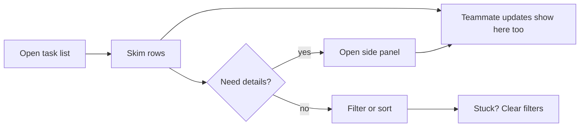

| Stage | Touchpoint | Action | Thought / Emotion | Pain to avoid | Opportunity |
|---|---|---|---|---|---|
| Trigger | Lands on main workspace after onboarding or bookmark | Scrolls to see all open work in one columnar list | "Show me the honest queue." | Empty chrome with no tasks; having to hunt multiple projects | Default land on dense list with status + assignee visible without configuration |
| Orient | List header, sort indicators, row chips | Scans columns for title, status, assignee, priority | "I can parse this in one pass." | Hidden ownership; cryptic status icons | Opinionated column visibility matching founder brief (dense, dark, professional) |
| Act | List row hover / row menu | Opens detail when needed; otherwise stays in list for triage | "Stay shallow until I must go deep." | Forced navigation to edit trivial fields | Inline affordances for status (see inline status feature) and clear row click target for detail |
| Confirm | Same list after teammate moves a card on board | Sees status/assignee update without refresh | "We share one truth." | Stale row after board update (parity failure) | Real-time or instant revalidation; same task ids across views |
| Recover / Next | Mis-sorted or overwhelming list | Changes sort (see sort feature) or applies filters | "Let me narrow without losing context." | Dead end after filter (zero results with no guidance) | Clear empty filter state + one-click reset |

### Feature: Quick add task — Task Inbox/List

- **Label:** core
- **Primary persona:** Priya Nair — captures client asks mid-review without breaking flow.
- **JTBD refs:** #2 (fast capture at start of day); #3 (low ceremony vs enterprise create dialogs)

**Happy path (interactions)**

1. From the task list (`/list`), tap the **+** (or the quick-add strip at the top—same idea).
2. A small add row or popover opens; your cursor is already in the **title** box.
3. Type what the task is. If you see them, you can pick **who** it’s for and **status**—otherwise defaults apply (often “To do” and you when you’re alone).
4. Press **Enter** or tap the main **Create** / **Add** button (final label follows the build).
5. A new row appears right in the list; you’re still on the list page unless you opened something else on purpose.
6. Peek at the **Board** view if you like—the same new task should be there without you refreshing.

**Edge / recover**

- You tried to save with no title? The app should stop you gently and not add a ghost row.
- Typo after it’s saved? Click that row, open the side panel (`/list?task=…`), and fix the title—it saves as you go.

**Interaction flow (Mermaid)**

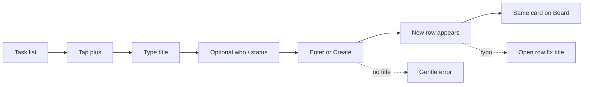

| Stage | Touchpoint | Action | Thought / Emotion | Pain to avoid | Opportunity |
|---|---|---|---|---|---|
| Trigger | List top bar or persistent "+" | Decides to log new deliverable while on a call | "If I don’t capture this now, it lives in Slack." | Buried create button; modal with 12 fields | Single obvious quick-add anchored to list |
| Orient | Quick-add popover / inline row | Sees title required; defaults for status/assignee | "Defaults should match how we work." | Forcing project/folder picks (out of scope guardrail) | Default To do + self assign when solo; minimal required fields |
| Act | Quick-add surface | Types title, optional assignee/status, commits | "One breath, one task." | Network lag with no optimistic row | Optimistic insert row; validate title non-empty |
| Confirm | List body | New row appears in unified list with chips | "It’s real, not a draft somewhere." | Task created in a hidden view | Scroll/focus to new row subtly; parity so board shows same card |
| Recover / Next | Mistyped title | Opens detail from new row or undo if offered | "Let me fix without shame." | Hard delete only; no path to edit | Soft focus title in detail; archive vs delete per brief |

### Feature: Inline status update from list — Task Inbox/List

- **Label:** core
- **Primary persona:** Miguel Santos — updates status without leaving keyboard flow.
- **JTBD refs:** #5 (fast status move before deadline; stays in sync with board/detail)

**Happy path (interactions)**

1. On the list (`/list`), find the task you care about.
2. Click the **small status control** on that row (the colored pill)—not the whole row if that opens the task panel.
3. Pick **To do**, **In progress**, or **Done**. Those are the only three in the first version.
4. It saves right away—no extra “Save” click.
5. The label on the row updates; if you (or a teammate) have the board or the task panel open, they see the same change.

**Edge / recover**

- Chose the wrong column? Open the menu again and pick the right one.
- Internet hiccup? The chip should snap back and a short message asks you to try again.

**Interaction flow (Mermaid)**

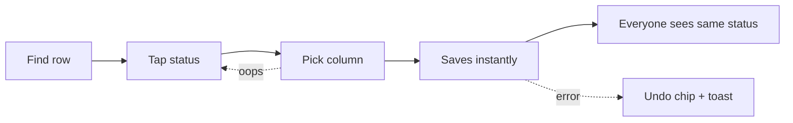

| Stage | Touchpoint | Action | Thought / Emotion | Pain to avoid | Opportunity |
|---|---|---|---|---|---|
| Trigger | Row shows in-progress client patch still in To do | Opens status control from list | "Don’t make me open a panel." | Only editable in detail | Status chip/dropdown always visible on desktop row |
| Orient | Inline status menu on row | Sees exactly three statuses (MVP) | "Matches the board mental model." | Surprise custom statuses in MVP | Locked labels To do / In progress / Done |
| Act | Dropdown or cycle control | Selects In progress | "Done." | Two-step confirm for non-destructive change | Single select applies; no save button |
| Confirm | Row + board (if open elsewhere) | Chip updates; board column reflects | "Parity holds." | Board lags list | Same mutation updates all subscribers |
| Recover / Next | Wrong column intent | Picks correct status again | Mild annoyance | No audit of who changed what when debugging handoffs | Lightweight updated-at + optional activity in detail |

### Feature: Filter by status/assignee/priority — Task Inbox/List

- **Label:** supporting
- **Primary persona:** Jordan Reyes — pre-milestone slice: "what does this contractor owe?"
- **JTBD refs:** #2 (narrow to execution context); #4 (clarity for micro-team without dashboards)

**Happy path (interactions)**

1. On the list (`/list`), open **Filter** in the toolbar.
2. In the little panel, tick what you care about: **status**, **who it’s assigned to**, and/or **priority**. All picks apply together (narrower list).
3. Apply. The list shrinks to matching tasks; the address bar can show those choices too (`?status=…&assignee=…`).
4. Read the shorter list; a count of matches may appear when the product ships it.
5. Board view might follow the same filters or stay wider—the UI should say which; pick what matches your mental model.

**Edge / recover**

- Nothing matches? You’ll see a friendly empty state and a **clear all filters** escape hatch.
- Board and list disagree? Use the “filters on board too” switch if we ship it, or read the one-line hint next to the filter.

**Interaction flow (Mermaid)**

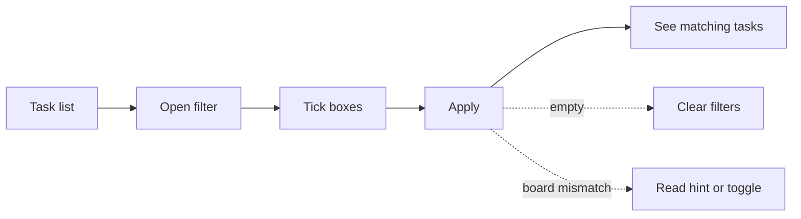

| Stage | Touchpoint | Action | Thought / Emotion | Pain to avoid | Opportunity |
|---|---|---|---|---|---|
| Trigger | List grows past ~15 mixed-client tasks | Opens filter control in list toolbar | "I only care about In progress + Alex today." | Export to spreadsheet workaround | Filter chips persistent but dismissible |
| Orient | Filter popover | Sees triad: status, assignee, priority | "Obvious AND logic." | Advanced query language | Simple multi-select with live result count |
| Act | Applies assignee + status | List re-renders subset | "This is my stand-up subset." | Full-page reload flash | Client-side or snappy server filter; preserve sort |
| Confirm | Row set + optional board sidecar | Only matching tasks visible; counts make sense | Trust | Board shows superset while list filtered — feels broken | Optional "filter applies to board" toggle or clear messaging |
| Recover / Next | Over-filtered to zero | Clears one chip at a time | "Where did everything go?" | Blank screen with no CTA | Zero-state copy + "clear all filters" |

### Feature: Sort by due date/priority/updated time — Task Inbox/List

- **Label:** supporting
- **Primary persona:** Miguel Santos — starts deep-work block with highest leverage thread.
- **JTBD refs:** #2 (re-order workload for execution clarity)

**Happy path (interactions)**

1. On the list (`/list`), open **Sort** in the toolbar.
2. Pick what to sort by: **due date**, **priority**, or **last updated**, and which way is “first” (up/down).
3. Rows reshuffle; your choice can also show up in the URL (`sort=…`).
4. Read from the top—that’s usually “what’s on fire next” when you sort by due date soonest-first.
5. Tasks with no due date sink to the bottom in that mode, with a nudge to add a date if you want them in the race.

**Edge / recover**

- Picked the wrong sort? Open the menu again and switch; the app may remember your last pick for you later.
- Dates look shifted by a day? Check the workspace timezone under **Settings → Workspace** (`/settings/workspace`).

**Interaction flow (Mermaid)**

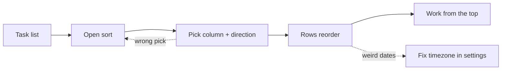

| Stage | Touchpoint | Action | Thought / Emotion | Pain to avoid | Opportunity |
|---|---|---|---|---|---|
| Trigger | Deadline morning | Opens sort menu on list | "What’s due soonest?" | Fixed arbitrary ordering | Expose due date / priority / updated sort |
| Orient | Sort dropdown | Reads current selection + options | "Predictable semantics." | Unclear ascending vs descending | Label arrows + persistent indicator in header |
| Act | Chooses due date ascending | List reorders | "Top is next fire." | Tasks without dates vanish or sort randomly | Explicit handling: nulls last + inline hint to add dates |
| Confirm | Rows animate or stable reorder | Scans top of list | Confidence | Sort appears changed but field wrong (timezone) | Respect workspace timezone from settings |
| Recover / Next | Wrong sort choice | Switches to updated time | Quick correction | No way back to prior sort | Remember last sort per user locally |

### Feature: Keyboard command quick capture — Task Inbox/List

- **Label:** nice-to-have
- **Primary persona:** Miguel Santos — expects desktop shortcuts; minimal mouse.
- **JTBD refs:** #2 (capture without leaving flow)

**Happy path (interactions)**

1. **Later release:** with the app window active, press a global keyboard shortcut (exact key TBD—we’ll avoid clashes with the OS).
2. The same quick-add box appears with the cursor in **title**.
3. Type the task, press **Enter**—same outcome as clicking + and saving.
4. Confirm the new row landed on your list (`/list`).

**Edge / recover**

- Shortcut not in the build yet? Use the normal **+** button; we shouldn’t tease a shortcut that doesn’t work.
- Shortcut did nothing? The window wasn’t focused—click the app, then **+** or try again.

**Interaction flow (Mermaid)**

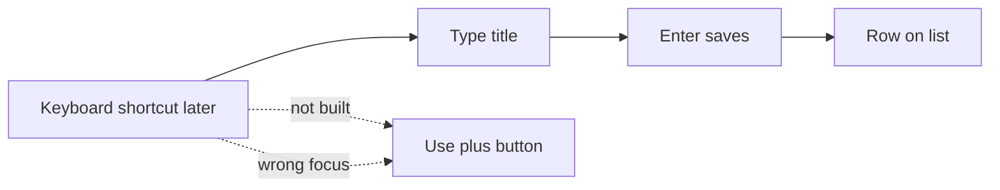

| Stage | Touchpoint | Action | Thought / Emotion | Pain to avoid | Opportunity |
|---|---|---|---|---|---|
| Trigger | Mid-typing in IDE or email | Hits global shortcut (when implemented) | "Open capture now." | Shortcut conflicts with OS/browser | **Post-MVP** per modules-features §4; document conflict-free default when shipped |
| Orient | Quick-add focused | Cursor in title field | "I’m already typing." | Focus trap stealing keys from wrong app | Only registers when app focused unless extension later |
| Act | Types title, Enter to save | Task created | Flow | Silent failure on Enter | Toast or row insert confirmation |
| Confirm | List updates | Sees task | Satisfaction | Parity miss | Same as quick add parity rules |
| Recover / Next | Shortcut not wired yet | Uses mouse quick add | "Fine for now." | Dead shortcut advertised in empty state | Gate hint in settings/help until feature ships |

### Feature: Three default status columns — Status Board

- **Label:** core
- **Primary persona:** Priya Nair — board is pipeline ritual for studio.
- **JTBD refs:** #3 (To do / In progress / Done without hierarchy theater); #5 (deadline alignment)

**Happy path (interactions)**

1. In the left sidebar, choose **Board**—you land on the board page (`/board`).
2. You always see **three** columns: **To do**, **In progress**, and **Done**—same words as on the list.
3. Skim cards in each swim lane of work; optional little counts per column may show up later.
4. You never “design” columns first—those three are already there.

**Edge / recover**

- Need a fourth stage like “Client review”? Not in v1—add a hint in the title or a comment, and tell us via feedback from **Settings → Workspace** where we explain why it’s locked.

**Interaction flow (Mermaid)**

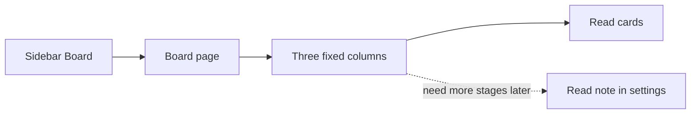

| Stage | Touchpoint | Action | Thought / Emotion | Pain to avoid | Opportunity |
|---|---|---|---|---|---|
| Trigger | Switches nav to Board | Views columns | "This is our motion." | Custom column setup before first card | Pre-built three columns matching statuses |
| Orient | Column headers + WIP visual density | Maps cards to stages | Calm | Mislabeled columns vs list statuses | Strict naming parity with task model |
| Act | Reads cards per column | Plans moves (pairs with drag feature) | "In progress isn’t a junk drawer." | Unlimited columns causing scatter | Fixed three in MVP per guardrail |
| Confirm | Card counts per column | Validates load balance | "We see overload." | No counts | Optional column counts (lightweight) |
| Recover / Next | Needs future custom status | Notes limitation | Pragmatic | Selling enterprise configurability in MVP | **Opportunity:** status configuration is nice-to-have/post roadmap — link to feedback not settings maze |

### Feature: Drag-and-drop status move — Status Board

- **Label:** core
- **Primary persona:** Priya Nair — moves creative tasks visually before client review.
- **JTBD refs:** #5 (drag board that syncs with list/detail)

**Happy path (interactions)**

1. On the board (`/board`), press the mouse on a **card** in any column.
2. Drag it; the columns light up so you know where you can drop.
3. Let go on **To do**, **In progress**, or **Done**—whichever matches reality.
4. The card slides there right away; the server catches up a beat later.
5. Check the list or an open task panel—the status text should match what you just chose.

**Edge / recover**

- You missed the column? The card bounces home; nothing changed.
- Save failed? Card returns and a toast explains it—try again.
- Landed in the wrong column? Drag back or fix it from the list with the status pill.
- Prefer keyboard? Use the list’s status menu or open the task—drag isn’t the only path.

**Interaction flow (Mermaid)**

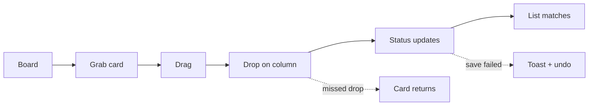

| Stage | Touchpoint | Action | Thought / Emotion | Pain to avoid | Opportunity |
|---|---|---|---|---|---|
| Trigger | Stand-up or async review on board | Grabs card | "Move means progress." | Drag disabled on desktop | Hit targets meet WCAG AA intent per brief |
| Orient | Column drop zones highlight | Sees ghost card | "I know where it lands." | Ambiguous drop between columns | Strong column affordance; keyboard alternative path if drag fails |
| Act | Drops in In progress | Releases pointer | "State changed." | Long request; card snaps back mysteriously | Optimistic UI + rollback toast on error |
| Confirm | Board + list + detail | Status chip everywhere updates | Trust | Any view stale | Single source of truth write |
| Recover / Next | Dropped wrong column | Drags back or uses inline list | Low cost | Accidental archive | Prefer status change over destructive gestures |

### Feature: Board/list/detail parity sync — Status Board

- **Label:** core
- **Primary persona:** Jordan Reyes — contractor on board, Jordan on list.
- **JTBD refs:** #5 (same tasks/statuses/owners); #2 (single picture)

**Happy path (interactions)**

1. Keep the list open in one place and the board (or a task side panel) in another—tabs are fine.
2. Change something real: owner, status, title—wherever you’re allowed to edit.
3. Flip to the other view without refreshing the whole browser if you can.
4. You should always read the **same** task: same person, same status, same headline.

**Edge / recover**

- Sat away for a while? Clicking back into the tab may refresh data when we wire that up.
- Two people edit at once? You might see a polite “someone else changed this” message and a soft reload—rare, but honest.

**Interaction flow (Mermaid)**

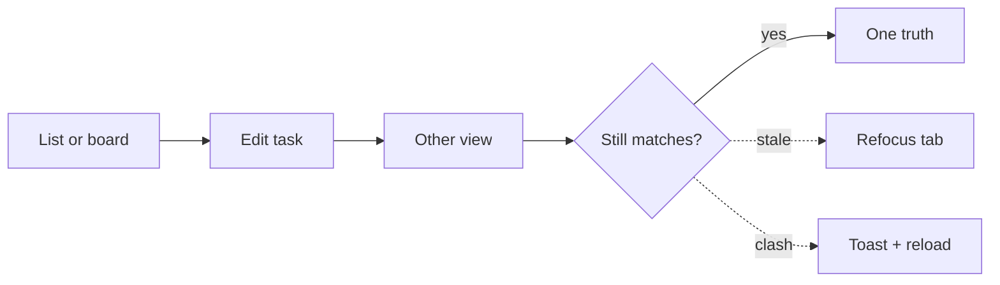

| Stage | Touchpoint | Action | Thought / Emotion | Pain to avoid | Opportunity |
|---|---|---|---|---|---|
| Trigger | Two surfaces open in tabs | Expects mirrored truth | "No debates about which screen lies." | Split-brain tools | Document parity as invariant in UI tests |
| Orient | Any view after mutation | Checks other tab | Vigilance | Needing manual refresh | Websocket/poll/revalidate on focus |
| Act | Updates assignee in detail | Watches list/board | "Propagates." | Partial field sync (status yes, assignee no) | Uniform mutation pipeline for task fields |
| Confirm | All surfaces show same assignee/status | — | Relief | Race: last-write wins without surfacing conflict | Timestamp conflict rare; show toast if rejected |
| Recover / Next | Stale cache edge | Refreshes page | Annoyance if frequent | No hard refresh story | Soft refetch button in toolbar |

### Feature: Swimlane/group by assignee — Status Board

- **Label:** supporting
- **Primary persona:** Jordan Reyes — sees per-person load inside each status.
- **JTBD refs:** #1 (who owes what without seat overhead); #5 (deadline coordination)

**Happy path (interactions)**

1. On the board (`/board`), switch on **Group by person** (the link may show `?group=assignee`—that’s normal).
2. Inside each status column you now see **lanes per teammate**: owner first, then everyone else A–Z, plus **Unassigned** when needed.
3. To hand work off, either **drag** the card into someone else’s lane (if we ship that) or open the card and change **Assignee** the usual way.
4. Check the list or a task side panel—the owner label should match the lane.
5. Too noisy? Turn grouping **off** and you’re back to a flat three-column board.

**Edge / recover**

- Too many lanes on screen? Use the same toggle—grouping off—instantly simpler.

**Interaction flow (Mermaid)**

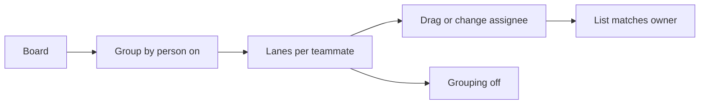

| Stage | Touchpoint | Action | Thought / Emotion | Pain to avoid | Opportunity |
|---|---|---|---|---|---|
| Trigger | Multiple contractors active | Toggles group-by assignee on board | "Whose In progress is bloated?" | Only manual scanning | MVP-essential per modules-features §4 |
| Orient | Lanes labeled by member + unassigned | Reads matrix | "Spatial clarity." | Lanes reorder randomly | Stable member sort (owner first, alphabetical) |
| Act | Drags card across lane boundary if supported, or reassigns | Updates ownership | "Rebalance work." | Drag breaks assignee semantics | Explicit assignee change action if cross-lane drag ambiguous |
| Confirm | List/detail assignee matches lane | — | Control | Lane shows old owner | Same parity pipeline |
| Recover / Next | Too many lanes | Turns grouping off | "Back to simple board." | Toggle buried | Prominent view option next to board/list switch |

### Feature: WIP limit indicators — Status Board

- **Label:** nice-to-have
- **Primary persona:** Miguel Santos — wants gentle overload signal without enterprise WIP config.
- **JTBD refs:** #2 (execution clarity); #5 (pre-deadline triage)

**Happy path (interactions)**

1. **Later release:** on the board, you might see a **soft hint** when “In progress” is getting heavy—think color or a small count vs a gentle limit.
2. It’s advice only: nobody is blocked from dragging more work in.
3. The team finishes a few cards (**Done**) and the hint relaxes.

**Edge / recover**

- Not in your build yet? Ignore it—drag should never be locked behind WIP in v1.
- Hint feels wrong for your crew? Ignore it, or hide it per workspace when we add that preference.

**Interaction flow (Mermaid)**

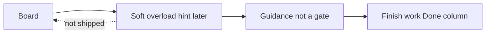

| Stage | Touchpoint | Action | Thought / Emotion | Pain to avoid | Opportunity |
|---|---|---|---|---|---|
| Trigger | In progress column feels heavy | Notices soft threshold styling (when shipped) | "We should finish before starting." | **Post-MVP** per §4 backlog — avoid blocking MVP board | Ship as visual-only hint first: column tint when count > N |
| Orient | Column header badge | Reads count vs limit | "Numerate overload." | Arbitrary limits with no tuning | Sensible default N with tooltip |
| Act | Team throttles new pulls | Moves cards to Done | Discipline | Hard enforcement (out of scope) | Advisory-only to match anti-bloat |
| Confirm | Indicator clears when under limit | — | Calm | Indicator wrong vs actual count | Derive from live query |
| Recover / Next | Limit feels wrong for team | Ignores indicator | Pragmatic | No dismiss | Optional hide per workspace (later) |

### Feature: Core task fields (title, description) — Task Detail

- **Label:** core
- **Primary persona:** Priya Nair — writes creative brief fragments on the task.
- **JTBD refs:** #3 (task identity without wiki); #4 (client-ready clarity)

**Happy path (interactions)**

1. From the list or board, open a task—either the **side panel** (`?task=…` in the URL) or the **full-page** link someone sent you (`/tasks/…`).
2. Click into the **title** or **description** boxes (plain text in the first version).
3. Type; the app saves quietly in the background after you pause typing (or uses a clear Save button—whichever we ship).
4. Look for a small **“Saved”** cue so you know it stuck.

**Edge / recover**

- Save failed? Tap **Retry** on the error strip—your words shouldn’t vanish silently.
- Wrong task? Press **Esc** to close the panel, or **Back** on the full page, and you’re where you were.

**Interaction flow (Mermaid)**

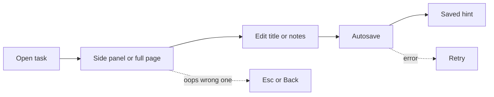

| Stage | Touchpoint | Action | Thought / Emotion | Pain to avoid | Opportunity |
|---|---|---|---|---|---|
| Trigger | Clicks row from list/board | Detail panel/page opens | "Context lives here." | Full navigation away losing list position | Split pane or overlay preserving list scroll |
| Orient | Title + description editor | Sees current content | "Plain is fine." | Rich-text bugs in MVP | Plain text MVP per founder brief |
| Act | Edits title/description; autosave or save | Types deliverable notes | "Autosave or obvious save?" | Data loss on blur | Debounced autosave + last-saved indicator |
| Confirm | Toast or inline "Saved" | — | Trust | Silent fail | Error banner with retry |
| Recover / Next | Wrong task opened | Uses breadcrumb/back to list | Low friction | No back gesture | Esc to close detail overlay |

### Feature: Assignee and priority — Task Detail

- **Label:** core
- **Primary persona:** Jordan Reyes — assigns rotating contractor.
- **JTBD refs:** #1 (shared assignees without seat drama); #4 (urgency + ownership visible)

**Happy path (interactions)**

1. Open the task—panel from list/board or full page link.
2. Open **Who’s on this?** (assignee) and pick someone who’s already in the workspace (guest assignees come later).
3. Set **How urgent?** (priority) if you use that signal.
4. It saves; close or peek behind the panel and you’ll see the same chips on list and board.

**Edge / recover**

- Picked the wrong person? Open the menu again and choose the right teammate.

**Interaction flow (Mermaid)**

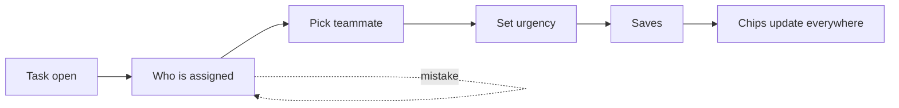

| Stage | Touchpoint | Action | Thought / Emotion | Pain to avoid | Opportunity |
|---|---|---|---|---|---|
| Trigger | Task needs owner before stand-up | Opens detail | "Who’s on the hook?" | Assignee picker empty | Seed workspace members in picker |
| Orient | Assignee dropdown + priority control | Sees self + teammates | "Simple enum." | Role jargon | Owner/member both assignable per micro-team model |
| Act | Picks assignee + High priority | Saves | "They’ll see it." | Requires re-invite to assign | Guest assignee rules deferred — only members MVP |
| Confirm | List/board chips update | — | Confidence | Priority invisible on board/list | Show priority chip consistently where spec demands |
| Recover / Next | Picked wrong person | Reassigns | Quick fix | Audit trail missing | Comment ping optional later |

### Feature: Due date — Task Detail

- **Label:** supporting
- **Primary persona:** Priya Nair — ties tasks to client review dates.
- **JTBD refs:** #5 (deadline / invoice window planning)

**Happy path (interactions)**

1. Open the task.
2. Tap **Due date**—a calendar pops up using the workspace’s timezone (set under **Settings → Workspace**).
3. Choose a day, or clear it if “no date” is honest.
4. Back on the list, you should see a tiny due hint on the row when dates matter for sort/filter.

**Edge / recover**

- Client moved the meeting? Open the same control and pick the new day.

**Interaction flow (Mermaid)**

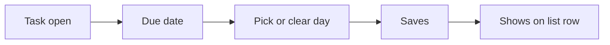

| Stage | Touchpoint | Action | Thought / Emotion | Pain to avoid | Opportunity |
|---|---|---|---|---|---|
| Trigger | Client sends date | Opens detail date field | "This drives sort." | Date buried | Datepicker near title block |
| Orient | Calendar popover | Sees timezone-aware day | "No UTC surprises." | Wrong timezone | Workspace timezone from settings |
| Act | Picks date; clears optional | Saves | "Nullable is OK." | Forced date on every task | Allow clear date |
| Confirm | List sort by due works | Row shows compact date | Visibility | Date not shown on list | Compact due label on row per MVP essential |
| Recover / Next | Date moved by client | Edits inline or detail | Adaptation | Versioning dates | Comment "date changed" optional |

### Feature: Image attachment upload — Task Detail

- **Label:** supporting
- **Primary persona:** Priya Nair — attaches mockups for campaign tasks.
- **JTBD refs:** #4 (visual proof for creative delivery)

**Happy path (interactions)**

1. Open the task and scroll to **Pictures / attachments**.
2. Drag a file onto the box or tap **Choose file**—images only, within the size/type rules shown.
3. Watch the **progress bar**; you can **Cancel** mid-upload if you picked the wrong thing.
4. When it lands, tap a **thumbnail** to preview it large (“lightbox”).

**Edge / recover**

- Upload failed (too big or offline)? Read the error and hit **Try again**.
- Wrong image saved? **Delete** it—may ask “are you sure?” so nobody nukes proof by accident.

**Interaction flow (Mermaid)**

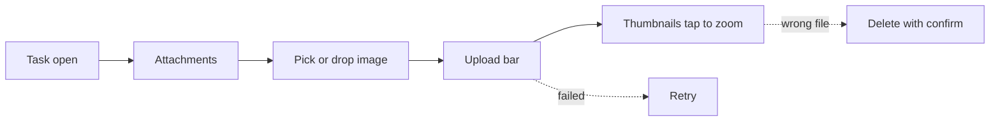

| Stage | Touchpoint | Action | Thought / Emotion | Pain to avoid | Opportunity |
|---|---|---|---|---|---|
| Trigger | Needs reference on task | Scrolls to attachments | "Boards aren’t Figma." | Out-of-scope video | Images only per brief |
| Orient | Upload dropzone + file picker | Sees size/type limits (5MB etc.) | "Fair guardrails." | Opaque failure | Presigned upload progress |
| Act | Selects PNG | Uploads | "Did it stick?" | Long hang no progress | Progress bar + cancel |
| Confirm | Thumbnail grid | Opens lightbox | "Client-facing proof." | Broken thumbnail | Retry upload affordance |
| Recover / Next | Wrong file | Deletes attachment | Clean slate | Accidental delete no confirm | Soft confirm delete |

### Feature: Task comments/activity trail (lightweight) — Task Detail

- **Label:** supporting
- **Primary persona:** Miguel Santos — async handoff with partner without Slack.
- **JTBD refs:** #1 (collaboration context); #5 (closure before deadline)

**Happy path (interactions)**

1. Open the task and scroll to **Comments**.
2. Read the thread—newest or oldest first stays consistent; each line shows who wrote it and when.
3. Type in the box at the bottom, then **Send**.
4. Your note appears in the thread right away, then firms up when the server says OK.

**Edge / recover**

- Fat-fingered right after sending? **Edit** or **Delete** inside the short grace window we allow in v1.
- Send didn’t go through? You’ll see a small error on that bubble—tap **Retry**.

**Interaction flow (Mermaid)**

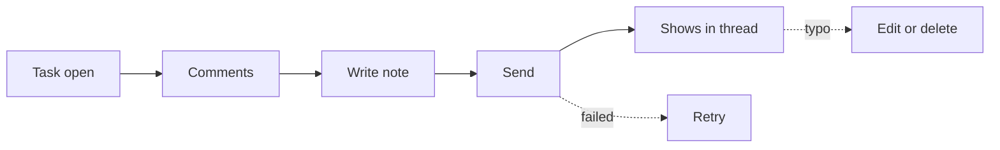

| Stage | Touchpoint | Action | Thought / Emotion | Pain to avoid | Opportunity |
|---|---|---|---|---|---|
| Trigger | Blocker note after deploy | Opens detail comments | "Keep it near the task." | Thread in Slack only | Comment stream anchored to task |
| Orient | Chronological list | Sees author + timestamp | "Lightweight, not Jira." | Full activity graph | Text comments MVP; system events minimal |
| Act | Types comment; submit | Adds @mention if supported later | "They’ll read this here." | **MVP:** plain comments without complex mentions | Start simple; mentions post roadmap |
| Confirm | Comment appears top/bottom consistent | — | Trust | Ordering bugs | Stable sort (oldest/newest toggle optional) |
| Recover / Next | Typo | Edit window or delete | Low shame | No edit | Allow short edit window |

### Feature: Subtasks/checklist — Task Detail

- **Label:** nice-to-have
- **Primary persona:** Priya Nair — breaks campaign task into asset checklist.
- **JTBD refs:** #4 (mini steps without full project hierarchy)

**Happy path (interactions)**

1. **Later release:** inside the task, open a **Checklist / subtasks** block when we ship it.
2. Add lines, tick them off as you go—like a mini to-do inside one card.
3. Optional: the parent row on the list may show “3/5 done” style progress.

**Edge / recover**

- Not in your build yet? Use the **description** field with simple bullet lines instead—it’s the honest workaround today.

**Interaction flow (Mermaid)**

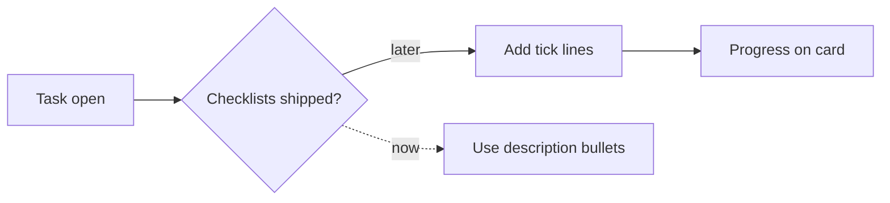

| Stage | Touchpoint | Action | Thought / Emotion | Pain to avoid | Opportunity |
|---|---|---|---|---|---|
| Trigger | Large deliverable in one card | Expands subtasks (when shipped) | "Checklist beats new cards." | **Post-MVP** per §4 | Keep description headings as MVP workaround in copy |
| Orient | Checklist UI | Sees progress % | Motivation | Nested sub-subtasks | One level only |
| Act | Adds items; checks done | Updates progress | "Micro wins." | Checklist doesn’t affect status | Optional "all done suggests move to Done" later |
| Confirm | Parent row shows progress chip | Teammate sees | Alignment | Parity: optional mirror on list row | Collapsed count on list |
| Recover / Next | Checklist too long | Collapses section | Focus | Performance drag | Virtualize long lists later |

### Feature: Invite teammate by email/link — Team & Access

- **Label:** core
- **Primary persona:** Jordan Reyes — invites 2-week contractor.
- **JTBD refs:** #1 (same list/board without extra paid seat elsewhere)

**Happy path (interactions)**

1. Go to **Settings → Team** (`/settings/team`)—or tap **Team** from the sidebar / empty-state hint.
2. Press **Invite someone**.
3. In the window: type their email **or** copy a **share link**—you should always see which workspace they’re joining and who invited them.
4. Send the email or paste the link in Slack/text yourself.
5. Back in the table, you’ll see a **Pending** row until they accept.

**Edge / recover**

- Wrong address? **Revoke** that invite and send a fresh one (owner only).
- Hit a “slow down” message on resend? That’s rate-limit protection—wait the seconds it says, then try again.

**Interaction flow (Mermaid)**

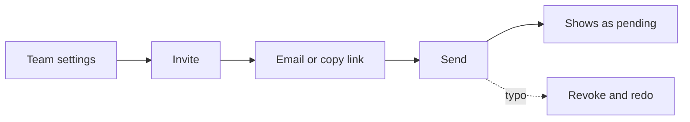

| Stage | Touchpoint | Action | Thought / Emotion | Pain to avoid | Opportunity |
|---|---|---|---|---|---|
| Trigger | New engagement starts | Opens invite from workspace menu | "Fast invite, no procurement." | Hidden invite | Always-visible team entry |
| Orient | Invite modal | Chooses email vs link | "They’ll know what they’re joining." | Opaque workspace name | Show workspace name + inviter |
| Act | Sends invite | Copies link or emails | "They’re in." | CAPTCHA hell on collaborator | Smooth magic-link pattern per brief posture |
| Confirm | Pending member appears | — | Expectation | No pending state | Join-state clarity feature complements |
| Recover / Next | Wrong email | Revokes/resends | Fix | Cannot revoke invite | Expire + resend |

### Feature: Simple member roles (owner/member) — Team & Access

- **Label:** supporting
- **Primary persona:** Miguel Santos — one owner, partner as member.
- **JTBD refs:** #1 (minimal governance)

**Happy path (interactions)**

1. As the **workspace owner**, open **Settings → Team**.
2. Find the person in the table and open the **Role** menu—only two choices: **Owner** or **Member**.
3. If you’re taking owner powers away from someone, confirm in the dialog when asked.
4. Badges update; in v1 **members can still edit tasks**—owners mainly control billing/settings later.

**Edge / recover**

- Logged in as a **member**? You’ll see the team list but not the dangerous owner buttons.
- Can’t delete the last owner—the app stops you with a clear sentence.

**Interaction flow (Mermaid)**

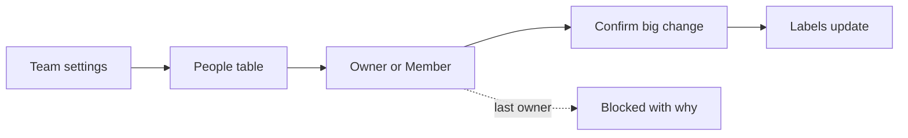

| Stage | Touchpoint | Action | Thought / Emotion | Pain to avoid | Opportunity |
|---|---|---|---|---|---|
| Trigger | First collaborator accepts | Owner checks permissions | "Who can break things?" | RBAC matrix | Binary owner vs member |
| Orient | Team settings table | Sees role column | "Obvious." | Enterprise roles (admin/editor/viewer stack) | Only two labels |
| Act | Promotes/demotes if ever needed | Changes role | Rare action | Accidental demote locks billing — N/A for donation model | Confirm modal on owner demote |
| Confirm | Role badge updates | Member sees allowed actions | Clarity | Member cannot perform needed task actions | Member full task edit; owner-only billing/settings later |
| Recover / Next | Wrong role | Owner adjusts | Recovery | No owner | Always ≥1 owner invariant |

### Feature: Join-state clarity (pending/accepted/expired invite) — Team & Access

- **Label:** supporting
- **Primary persona:** Jordan Reyes — tracks whether contractor actually joined.
- **JTBD refs:** #1 (visibility without login juggling)

**Happy path (interactions)**

1. Open **Settings → Team**.
2. Scroll the **Invites** area—each row is labeled **Pending**, **Accepted**, or **Expired**, with times (and maybe a countdown until expiry).
3. Still waiting on someone? **Resend** the email or **Copy link** again—within fair use limits.
4. When they join, the row becomes a normal **member** with their avatar.

**Edge / recover**

- Link died? Use **Make a new link** / regenerate invite—no need to ping support for a fresh token.
- Stuck on “Pending” even after they joined? Refresh the page; if it’s still wrong, that’s a bug to flag.

**Interaction flow (Mermaid)**

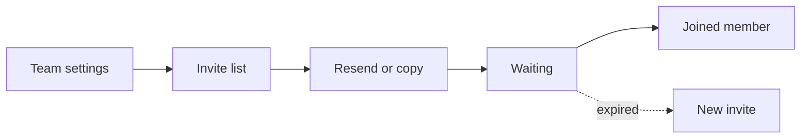

| Stage | Touchpoint | Action | Thought / Emotion | Pain to avoid | Opportunity |
|---|---|---|---|---|---|
| Trigger | Sent invite yesterday | Opens team panel | "Did they click?" | Black hole | Explicit pending/expired chips |
| Orient | Invites list | Reads timestamps | "When to nudge." | No expiry story | Show expiry countdown per invite policy |
| Act | Resends or copies fresh link | Follows up | Pragmatic | Spammy resend | Rate-limit with friendly copy |
| Confirm | State flips to accepted | Avatar appears | Relief | Stuck pending after accept | Webhook-style poll on team panel focus |
| Recover / Next | Expired | One-click regenerate | Fix | Manual support | Self-serve renew invite |

### Feature: Guest/client read-only access — Team & Access

- **Label:** nice-to-have
- **Primary persona:** Priya Nair — wants client to see status without collaborator seat.
- **JTBD refs:** #1 (visibility without seat-tax); #5 (client confidence)

**Happy path (interactions)**

1. **Later:** you’ll get a **Share with client (view only)** entry point somewhere sensible.
2. The app makes a **read-only link**—the screen should scream “they can’t edit.”
3. **Copy**, paste into an email to the client.
4. They open it and see list/board **without** edit powers.

**Edge / recover**

- **Today’s MVP:** there is no magic client link—export a screenshot or PDF if you need to show status.
- When links exist, you can **Revoke** them from a list if the client shouldn’t see anymore.

**Interaction flow (Mermaid)**

```mermaid
flowchart LR
  X{Client links shipped?}
  X -->|yes| SH[Share view-only]
  SH --> L[Copy link]
  L --> V[Client reads only]
  X -.->|not yet| SS[Screenshot workaround]
```

| Stage | Touchpoint | Action | Thought / Emotion | Pain to avoid | Opportunity |
|---|---|---|---|---|---|
| Trigger | Client asks "where are we?" | Considers share link (future) | "Read-only is enough." | **Post-MVP** per §4 | Position in roadmap comms; MVP: export screenshot workaround |
| Orient | Share dialog (future) | Sees read-only badge | Trust | Client edits tasks by accident | Hard server enforced read-only role |
| Act | Copies client link | Sends | "Professional." | Token leak | Expiring tokens |
| Confirm | Client view loads board/list read-only | — | Pride | Parity breaks | Read replica of same views |
| Recover / Next | Client shouldn’t see anymore | Revokes token | Safety | No revoke | Revocation list |

### Feature: Create workspace + first task in <=2 steps — Activation & Onboarding

- **Label:** core
- **Primary persona:** Miguel Santos — evaluates tool in <5 minutes.
- **JTBD refs:** #2 (time-to-truth); #3 (no architecture project)

**Happy path (interactions)**

1. Start at **Sign up** or **Log in**, type your email, click the **magic link** in your inbox—no password to remember.
2. First time in with no workspace yet? Name your **workspace**, double-check **timezone**, hit **Continue**.
3. Next screen: type a **first task** title (you can tweak who it’s for if we show that)—**Create** it, or **Skip** if you just want to look around.
4. You land on the **task list**—either with that first row, or with the friendly empty checklist if you skipped.

**Edge / recover**

- Left the workspace name blank or tried to save an empty task title? Inline red text tells you what’s missing.
- Named the company wrong? Fix it anytime under **Settings → Workspace**.

**Interaction flow (Mermaid)**

```mermaid
flowchart LR
  R[Sign up or log in] --> M[Magic link email]
  M --> W[Name workspace]
  W --> F[First task or skip]
  F --> C[Land on list]
  W -.->|fix errors| W
  F -.->|fix errors| F
```

| Stage | Touchpoint | Action | Thought / Emotion | Pain to avoid | Opportunity |
|---|---|---|---|---|---|
| Trigger | Landing from marketing | Starts signup | "Don’t waste my night." | Long forms | Workspace name + user in one flow |
| Orient | Step indicator (max 2) | Sees next is first task | Predictable | Surprise email verify wall | If email verify needed, still ≤2 product steps after auth |
| Act | Names workspace; creates first task title | Submits | "Already useful." | Forced invite before value | Invite deferred to empty state guidance |
| Confirm | Unified list shows task | — | Momentum | Empty state persists incorrectly | Immediate transition to list/board |
| Recover / Next | Typo in workspace name | Renames in settings later | Low regret | Locked forever | Workspace rename in basics settings |

### Feature: First-use empty state guidance — Activation & Onboarding

- **Label:** supporting
- **Primary persona:** Priya Nair — orients studio without admin manual.
- **JTBD refs:** #2 (first minutes on throughput); #3 (low cognitive load)

**Happy path (interactions)**

1. You open the list or board and it’s **empty** on purpose—first day in the product.
2. You see a **short checklist** (think three buttons max): add a task, move something on the board, maybe invite someone.
3. Tap each suggestion—it jumps you to the real control (plus button, board, **Team** settings)—no fake demo data forced on you.
4. Once there’s at least one real task, the big empty illustration goes away; if you delete everything again, we may show a softer hint.

**Edge / recover**

- Skipped the invite step? No guilt trip—open **Team** from the sidebar whenever you’re ready.

**Interaction flow (Mermaid)**

```mermaid
flowchart LR
  L[Empty list] --> E[Three friendly CTAs]
  E --> A[Add task]
  E --> B[Move on board]
  E --> T[Invite people]
  A --> D[Screen clears when you have tasks]
  E -.->|skipped invite| T
```

| Stage | Touchpoint | Action | Thought / Emotion | Pain to avoid | Opportunity |
|---|---|---|---|---|---|
| Trigger | Lands on empty workspace | Sees empty list/board | "What now?" | Blank generic template per founder fear | Tailored dark compact empty illustration + 3 CTAs |
| Orient | Checklist: first task, first status move, first invite | Reads short copy | "I can skim." | Essay | Max 3 bullets |
| Act | Clicks suggested actions sequentially | Completes seed actions | "Guided, not babysat." | Forced sample data | Optional template ties to sample project feature |
| Confirm | List/board non-empty | Empty state dismisses | Achievement | Dismiss too aggressive if user deletes all | Re-show gentle hint if zero tasks |
| Recover / Next | Skipped invite | Returns via team menu | OK path | Guilt copy | Positive tone |

### Feature: Sample project template — Activation & Onboarding

- **Label:** nice-to-have
- **Primary persona:** Jordan Reyes — wants freelance-shaped starter tasks.
- **JTBD refs:** #2 (faster orientation); #4 (credible structure)

**Happy path (interactions)**

1. **Later:** from the empty screen, tap **Start from a template** when we ship it.
2. Pick something small—like a “freelance week one” starter—not a library of 50 templates.
3. Tasks appear in your workspace; we may label them as **demo** so you can bulk-delete if you don’t want them.

**Edge / recover**

- **Today:** templates aren’t there yet—just tap **Add task** and type your own.

**Interaction flow (Mermaid)**

```mermaid
flowchart LR
  E[Empty screen] --> X{Templates ready?}
  X -->|yes| P[Pick starter pack]
  P --> I[Tasks appear]
  X -.->|not yet| M[Add your own task]
```

| Stage | Touchpoint | Action | Thought / Emotion | Pain to avoid | Opportunity |
|---|---|---|---|---|---|
| Trigger | Empty state "use template" | Clicks | "Show me conventions." | **Post-MVP** per §4 | Until shipped, link to manual first task only |
| Orient | Template picker | Sees 1–2 simple presets | Not overwhelming | 20 templates | One freelance default |
| Act | Applies template | Board fills | "I’ll rename, not rebuild." | Pollutes production with fake clients | Clear "demo tasks" banner with bulk delete |
| Confirm | Tasks editable/deletable | — | Control | Locked demo | All real tasks post-insert |
| Recover / Next | Chose wrong template | Deletes batch | Cleanup | No multi-select | Multi-select delete later |

### Feature: Workspace basics (name, timezone) — Light Settings & Trust

- **Label:** supporting
- **Primary persona:** Jordan Reyes — EU clients + US work; timezone correctness for due dates.
- **JTBD refs:** #1 (coordination); #5 (deadline truth)

**Happy path (interactions)**

1. Click your **avatar** (or **Settings**), then **Workspace**—that’s `/settings/workspace`.
2. Change how the workspace is **named** or which **timezone** dates should follow.
3. Hit **Save** (or we autosave and tell you—same outcome).
4. Go back to the list—due dates and sorts should now “feel” right for your region.

**Edge / recover**

- Not the owner? You can read the page but editing is locked—that’s intentional.
- Empty name? We block save until you type something sensible.

**Interaction flow (Mermaid)**

```mermaid
flowchart LR
  A[Settings menu] --> W[Workspace page]
  W --> E[Change name or timezone]
  E --> S[Save]
  S --> L[Due dates make sense]
  W -.->|not owner| RO[View only]
```

| Stage | Touchpoint | Action | Thought / Emotion | Pain to avoid | Opportunity |
|---|---|---|---|---|---|
| Trigger | Due dates look off | Opens settings | "Fix the basics." | Settings maze | Small settings surface |
| Orient | Name + timezone fields | Sees current values | "Only what matters." | 50 toggles | Single page section |
| Act | Updates timezone; saves | Confirms | "Dates should align." | Silent apply | Explicit save or autosave with feedback |
| Confirm | Due labels re-render | — | Relief | Old cached dates | Invalidate client cache on TZ change |
| Recover / Next | Broke name | Reverts edit | Low stakes | No undo | Inline validation |

### Feature: Status configuration (locked in MVP, extensible later) — Light Settings & Trust

- **Label:** nice-to-have
- **Primary persona:** Priya Nair — may want Client review later; not MVP.
- **JTBD refs:** #3 (future flexibility); #5 (workflow fit)

**Happy path (interactions)**

1. Still on **Settings → Workspace**.
2. Read the short note: **only three statuses** exist in v1—To do, In progress, Done—and you can’t rename them yet.
3. If you’re itching for a fourth stage, use the **feedback** link—we want to hear it without pretending the toggle works today.

**Edge / recover**

- Need something like “Client review” right now? Add it to the **task title** (`[Review] …`) or drop a **comment**—no secret fourth column hiding in settings.

**Interaction flow (Mermaid)**

```mermaid
flowchart LR
  W[Workspace settings] --> R[Read three statuses]
  R --> F[Optional feedback]
  R -.->|need more nuance now| C[Title tag or comment]
```

| Stage | Touchpoint | Action | Thought / Emotion | Pain to avoid | Opportunity |
|---|---|---|---|---|---|
| Trigger | Wants fourth column someday | Visits settings (future) | "Later." | **MVP locked** per modules-features + founder brief defaults | Show read-only explanation of three statuses |
| Orient | Disabled or absent editor | Reads "locked for MVP" | Acceptance | Teasing nonfunctional toggle | Honest copy + feedback link |
| Act | Sends feedback | Submits short request | "I’ll wait for a real migration path." | False hope that toggles work today | Capture request; don’t pretend config exists |
| Confirm | Read-only status explainer remains accurate | Closes settings | "At least they’re honest." | Drift between copy and product (e.g. hidden fourth column) | Keep copy versioned with releases |
| Recover / Next | Needs Client review now | Uses task title prefix or comment convention | Pragmatic | Forcing custom status in MVP | Document lightweight naming patterns internally |

### Feature: Non-blocking donation reminder — Light Settings & Trust

- **Label:** supporting
- **Primary persona:** Priya Nair — tolerant if dismissible and tasteful.
- **JTBD refs:** #1 (free core collaboration); #3 (trust without paywall)

**Happy path (interactions)**

1. After you’ve been productive for a while (or on a calm timer), a **small banner or modal** may ask if you’d like to support the product.
2. Read it—it should sound optional, not scary—and either **Dismiss** and keep working, or **Donate** and we send you through a payment page, then you land back here.
3. Want to chip in later? **Settings → Donation** is always there for amount or reminder cadence.

**Edge / recover**

- If you dismiss it, we shouldn’t nag you again in the next five minutes—cooldowns keep it respectful.

**Interaction flow (Mermaid)**

```mermaid
flowchart LR
  M["After a good session"] --> B[Gentle ask]
  B --> D[Not now]
  B --> N[Support us]
  D --> W[Keep working]
  N --> W
  W --> S[Donation settings anytime]
```

| Stage | Touchpoint | Action | Thought / Emotion | Pain to avoid | Opportunity |
|---|---|---|---|---|---|
| Trigger | Session milestone or time-based | Modal/banner surfaces | "Here it comes." | Blocking modal | Dismiss continues work per brief |
| Orient | Copy explains optional support | Reads once | "Fair." | Guilt manipulation | Neutral tone; no dark patterns |
| Act | Dismisses or donates | Chooses | Autonomy | Paywall on features | Never gate task actions |
| Confirm | Banner stays dismissed per policy | — | Respect | Reappears every minute | Sensible cooldown |
| Recover / Next | Wants to donate later | Opens from settings/about | Positive | Hidden donate | Persistent low-key entry in menu |

### Feature: Personal notification controls — Light Settings & Trust

- **Label:** nice-to-have
- **Primary persona:** Priya Nair — escaped noisy PM once; fears repeat.
- **JTBD refs:** #3 (reduce noise vs all-in-one)

**Happy path (interactions)**

1. Open **Settings → Notifications** (`/settings/notifications`).
2. Early builds may just explain **what emails you get today** and say richer controls are coming—read it once so expectations match reality.
3. When switches appear: turn types of email on or off (mentions, assignments, digest, etc.), then **Save**.

**Edge / recover**

- Turned something off and missed news? Flip that category back on—and remember **comments on the task** still carry the story if mail failed.

**Interaction flow (Mermaid)**

```mermaid
flowchart LR
  S[Notification settings] --> R[Read current rules]
  R --> T{Switches exist?}
  T -->|yes| F[Toggle + save]
  T -.->|not yet| C[Explainer only]
  F -.->|too quiet| RE[Turn category back on]
```

| Stage | Touchpoint | Action | Thought / Emotion | Pain to avoid | Opportunity |
|---|---|---|---|---|---|
| Trigger | Email pings too often (future channel) | Opens notification settings | "Let me throttle." | **Post-MVP** per §4 | MVP may ship with email defaults only — set expectations |
| Orient | Simple toggles: mentions, assignments, digest | Reads labels | "Understandable." | Per-task overrides | Global workspace-level first |
| Act | Turns off noisy class | Saves | "Sanity." | Hidden dependencies | Don’t break invite emails |
| Confirm | Fewer emails arrive | — | Calm | No confirmation | Send test email optional later |
| Recover / Next | Missed important ping | Re-enables category | Learning | No audit | Activity trail in task as backstop |
